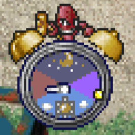
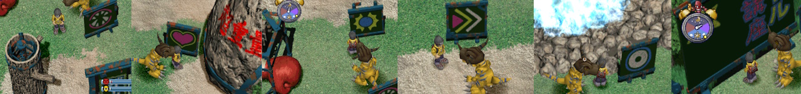

# Digimon World PSX Walkthrough

Digimon is an open world game for the original playstation and came out in 1999. While lesser known to the franchise Pokemon, Digimon had a huge following. The goal of the game was to explore a digital world and recruit as many digital monster back a city. As you progresed the game the city grew, eventually enough monsters are recruited and a final dungeon opened with a final boss waiting for you. The game has almost no direction on where to go and a ton of hidden mechanics. As a kid I struggled through this game even with excessive gameshark usage. Now I'm older, I wanted to go back and figure out how the game worked. What started off as notes reliving my childhood, it turned into an entire guide on how to beat it. 

It has taken a while, but the mechanics of the game have been pretty well reverse engineered. It's still not perfect and lot of hidden conditions are still being discovered or are poorly understood. 

I've compiled a list of references for this game that made this all possible

| Link | Description |
|------|-------------|
| [Ginoshie's Google Document](https://docs.google.com/document/u/0/d/1aHHXZXjZNDabFTWUdF055M0oshyC57kff5NVc2BTYGE/) | One of the definitive efforts in understanding the game |
| [Digimon Recruitment Tracker](https://fliegenfuerst.github.io/dw1/recruitment) | A reference to help you keep track of which Digimon you have recruited and which ones are available |
| [Battle Techniques](https://fliegenfuerst.github.io/dw1/moves) | A reference that tells you how likely you are to learn a battle technique |
| [World Map](https://imgur.com/d0MG5Ug) | A giant map of the Digimon World |
| [Evolution Stats](https://digislots.fippi.io/) | A website that shows some necessary evolution stats |
| [Evolution Calculator](https://phoenix-staffel.de/digimon/DigimonWorld/evolution.html) | A calculator to help you figure out how your current stats will effect evolutions |
| [Evolution Stat Gain Calculator](https://www.phoenix-staffel.de/digimon/DigimonWorld/statsgain.html) | A calculator to help you figure out how much your stats will increase on evolution |
| [Digivolution Guide](https://anaiadnamedlaura.tumblr.com/digivolution) | A visual website to see what you can evolve into |
| [Item Spawns](https://fliegenfuerst.github.io/dw1/items/) | A list of items, where they are found, and how often | 

I created a route. If you are ever stuck you can kill your existing digimon 3 times in a row in battle and start over. Select the Green egg and train Defense/Speed/Brain for Gabumon or train Offense/HP/MP for Agumon. 

## Pre Game
Out of the gate you'll be asked some ambigous questions that have implications of which digimon you start with. 

* No Digivice and have friends = Agumon
* No Digivice and no friends = Gabumon
* Digivice and prefer day = Agumon
* Digivice and prefer night = Gabumon

Agumon is honestly a much better choice for a beginner to the game.

1. Gabumon starts with lower health, offense, and speed. You will need to spend extra time grinding stats in the early game to use this digimon. 

2. Gabumon has a much weaker starting attack. Sonic jab does much less damage and does not interrupt other attacks causing you to take much more damage. Because of this you will need to fight about 8 extra battles to learn new moves. 

### Tangent

Starting with Gabumon for the first time and playing blind without resources was like playing this game on an extra hard difficulty. 

You will struggle more and spend a lot more time investing in each digimon and therefore grow a stronger emotional connection. Perhaps that's the intent behind why they ask this question. Reflecting back as a kid it was fairly traumatizing the first time my digimon died. Instead of being an escape from reality, this game does a great job of demonstrating the certainties in life. It's in your face, you eat, you sleep, you poop, you get tired, you make friends, you help them grow, you go on adventures, you make mistakes, you learn, you have fun it's exciting, you better communities, but every decision you make has an effect. Like a good pixar film, this got better as I aged. I've never seen a game like it.

## Lay of the Land
* Go back inside into Jijimons house
* Talk to Tokomon, the white digimon for a set of free items
* Then talk to the red giant gameboy on the bottom left to save the game

There's a clock on the top left to tell you what time it is, enemies and events change depending on the time of day. The clock is ticking, to stop time and research something, press start or open the menu with Triangle. Digimon only live so many days and evolve based on how old they are, this mechanic makes exploration very difficult for a beginner. Pause whenver you need to look something up. Fishing and battles pause time as well.

Go outside and up and talk to the green digimon Tanemon by the meat farm and get 3 meat. Throughout the game your digimon gets hungry and you need to fully feed it before the indicator disappears, depending on how disciplined it is you have 12-72 seconds otherwise it gets a care mistake, it might take multiple meats. Meat is a limited resource so only feed when hungry and make sure to come back every day. To feed your digimon open the item menu and select a meat.

Go back in front of Jijimon's house and talk to the white/purple digimon Yuramon. We will come back to this digimon to progress the story line a couple times.

Your digimon communicates to you via thought bubbles. As they pop up you will likely need to do something to avoid a care mistake making evolution harder. We'll explain them as we go. If multiple thought bubbles occur at once you may not see them. To avoid not fixing an issue when you should have make sure to open the menu and select the scale to see all the thought bubbles at once.

To avoid care mistakes:

1. Feed when needed. When you see a meat thought bubble, open the menu and feed them with a food. Stick with meats and digishrooms at the start of the game. After feeding, double check it is full from the menu as it may take multiple meats.

2. Go to the bathroom when needed. There's a bathroom left of Jijimon's house, they are also scattered around the world and you need to be careful planning trips to not get too far away until portapotties and autopilots can be bought. If you poop on the ground it lowers happiness and discipline affecting evolutions and will eventually turn you into a poop monster requiring a side quest or multiple deaths and hours of retraining to resolve.

3. Sleep before your digimon is supposed to wake up. It doesn't matter how many hours of sleep or where. You can force your digimon to stay up when sleepy and do some late night training or battling and it will not impact care mistakes nor will it reduce lifetime of your digimon vs just sleeping.

From Jijimon's house head left to the gym.

STOP and pause the game.

Don't do any training for now and let me explain how they work.

Training: The gym has a tree to train offense, a rock to train hp, a punching glove to train defense, a track to train speed, a waterfall to train mp, and a chalkboard to train brains. If you train at any of these stations it'll make two of your stats stronger. When you do train stick to non bonus training as the slots are very unfavorable unless RNG manipulated. Each training greatly impacts your needs to respond to prevent care mistakes.

Hunger: Each training increases how hungry you are. Make sure to feed until FULL before any trainings to avoid care mistakes. As you add feed it changes weight, how often you need to go poop, happiness, discipline, and tiredness.

Pooping: As you eat more you need to go to the bathroom more. Don't train when needing to poop.

Tiredness: Eventually you'll find each training makes you more tired. Going to Jijimon's house and talking to the red digimon Punimon lets you sleep for an hour lowering tiredness. Until the Hospital is unlocked it is best go to here and sleep twice to recover tiredness. Don't rest when hungry or needing to poop. Resting is not the same as sleeping. Tiredness also goes away when you put your digimon to sleep during their sleep window. I don't sleep when needing to eat or poop. Although I read it may not affect care mistakes. Every 10 min you are tired causes you to lose weight.

Praising: Using the menu option praise increases happiness but decreases discipline.

Scolding: Using the menu option scolding decreases happiness but increases discipline. 

If you scold after pooping on the ground or refusing to eat something BEFORE moving it'll greatly increase both happpiness and discipline while allowing the item to be consumed on the next try.

Triangle opens the menu

Battle Techniques: You can learn new battle techniques from either having an enemy attempt them in battle against you or training brains. The chances of you learning a move are usually pretty low. For every 50 brains stats you level there's a chance you will learn one you haven't seen yet. Digimon can only learn moves applicable to them and sometimes they can use it, but not learn it. Once a move is learned it will carry forward to all future digimon. Once learned you will also need to open the menu and teach them to your digimon manually.

There are a lot of ways to play this game. Each digimon can evolve into quite a few different options. For the first playthrough I recommend going with Greymon or Garurumon. 

In order to start preparing our Agumon/Gabumon so we can evolve into Greymon/Garurumon let's take a look at our stats. 

Gabumon starts with 700hp, 700mp, 70 off, 80 def, 60 speed, 70 brains, 50 discipline, and 50 happiness.

 -> 

Agumon starts with 800hp, 600mp, 80 off, 60 def, 70 speed, 70 brains, 50 discipline, and 50 happiness

 -> 

What we evolve into depends on Time, Current Stats, Weight, Care Mistakes, and having a single Bonus Condition. 

* Time: 72 hours must pass before a rookie digimon can become a champion
* Current Stats: Thanks to the calculator referenced above we know Garurumon requires both 1000 mp and 100 Speed while keeping brains as low as possible to avoid other evolutions. Greymon requires 100 offensive, 100 defense, 100 speed, and 100 brain. Keeping brain the lowest of the 4 stats to avoid other evolutions.
* Weight: Both require your weight to be 25-35. We are currently at 15, we just need to add 10, and not overfeed.
* Care Mistakes: Both have the same <=1
* Bonus Condition: Both have the same >=90 discipline

If you accidentally make a mistake, the 90% discipline bonus condition is very easy to get and I would encourage you still do this to guarantee proper evolutions even if you have the proper stats and believe you did everything right. When you have plenty of recovery floppies, you can simply attempt to feed a recovery floppy, when it refuses, scold, move, and repeat. This will burn a few floppies and stop working with higher discipline. When this happens, just scold without attempting to feed.

To follow the guide, don't do any extra leveling or you may get different digimon.

Training this way should get us our desired evolutions

Agumon:

- 3 offense (tree)
- 3 speed (track)
- 5 defense (punching glove)
- 2 brain (chalkboard)

Gabumon:

- 6 speed (track)
- 4 mp (waterfall)
- 2 hp (rock)
- 4 speed (track)

## Early Game

To finally start the game train:

- Agumon - 3 offense, 3 speed
- Gabumon - 6 speed

Be sure to rest (not sleep), feed, and poop as needed. It's best to check the player menu after each train to avoid care mistakes. Sleep can be delayed if needed without a care mistake as long as you go to bed before wake up time.

Any more trainings on the first day and your digimon will be suffering from being too tired.

Run south fight agumon, win to recruit

Throughout the game keep an eye out for any digishrooms as we can trade them later for good money.

Continue south west, continue south, on the toilet screen head east

Do NOT feed the yellow Kunemon till later so we are sure to be strong enough to fight him.

Go SE, S, at the beach in the red afternoon talk to Coelamon the fish in the water and he'll help you cross the lake. 

Once landed there's an item chest, go right of this and exit N to the forest. Go to the top right to get Betamon. Return to the chest.

Go east, hug the outside wall to avoid the enemies and get to Centauromon's challenge. 

The goal is to make your way to the giant Circle which is randomly assigned to a lane. Don't stop for any anything, he likes to shoot you whenever you line up vertically with your digimon. You can reliably avoid failing this challenge by running up the right lane, take the gap in the wall and cut left and then again to the far left side. You should be able to see which lane you need and may need to go back right. Heal after the challenge if you need to.

Return to the chest, then go W and cross the bridge, then head S all the way back to Coelamon to recruit him. 

Go N to Kunemon, then W to the toilet, then N, when you see a flashing screen head W to drill cave. Exit S, in the room with a bunch of enemies go W and fight the drimogeon. You'll likely need to use small recoveries during the fight. 

Once completed exit, in the room with enemies go E, and talk to drimogeon. Say no thanks and go back to town. (W,N,E,E,NE,E) We'll return in 5 days.

Talk to Coelamon in town and sell the restore, buy 20 meat, 1 auto pilot, 9 hp recoveries

Then go to the hospital underneath and heal tiredness.

Train:

- Agumon -  5 Defense
- Gabumon -  4 MP, 1 HP

Collect 3 meat from the farm and sleep. 

Continue training:

- Agumon - 2 Brain, 3 HP
- Gabumon - 1 HP, 4 Speed

Gabumon should be close to: 

- 969 hp, 1023 mp, 78 offense, 90 defense, 132 speed, 74 brains

Agumon should be close to: 

- 1072 hp, 623 mp, 112 offense, 104 defense, 102 speed, 100 brains

Talk to yuramon outside jijimons house and he'll say something about the great canyon's invisible bridge.

Head South and go fight Kunemon.

Give Kunemon a meat or shroom to start the fight
Open the item menu and throw heals when <500hp as needed, it shouldn't be too tough, time your square attack so you don't get interrupted and are not flattened. Collect the mp chip after.

Go W then S and fight Palmon, collect the brain chip after.

Return to town with the new shortcut (N, E, N, W) and sell thd brain chip and mp chip. Then buy 40 meat, buy 40 hp, buy 2 auto pilots, and 18 mp.

Train:
* Agumon - 1 MP
* Gabumon - 1 Speed

Go to hospital and heal tiredness twice.

Agumon: Head W out of town and go S back to where we fought Palmon. Fight Gobirimon until you learn Magma Bomb (22% per battle if attempted). Then go back to the Tropical Forest toilet N of where Coelamon dropped us off (E,N,E,S,N). 

Gabumon: Head E out of town over the bridge to the tropical jungle at night. Optional: Fight Tsukaimon's until you learn Dynamite Kick (24% per battle). Then teach just that in the menu forgetting Sonic Jab. Not optional: N of where Coelamon dropped us off is a toilet, fight Jmojymon's there until you learn megaton punch (22%). Then teach just that. 

Exit N from the Tropical Forest toilet, Hold Up+Left on screen load, head up to the gate guarded by two enemies. Approach from the left to draw the guy out and run in. Head up and to the left to go around the tree, then go right and talk to the ghost Bakemon. Answer yes, yes, no. Go back leaving the area HOLDING up+right to dodge the enemies, then exit east.

Cross the invisible bridge. Walk into the shop on the right. Don't hold any buttons. Immediately sleep and SAVE. Monochromon's shop relies on heavy RNG. This save will allow us to save reset until we get it. The RNG logic can be easily controlled to side in our favor. To do this legit overcharge green/pink, charge normal for the rest and hope for the best, you need 3072 to win. Otherwise this RNG manipulation worked for me. Reset, reload, on load hold left and repeatedly tap X. https://www.youtube.com/watch?v=yChACY6CaGg 

RNG Manipulation Order:

- Gotsu-Meat: Raise-Rethink-Raise
- Goburi-Potty: Raise
- Goburi-Medicine: Raise
- Weed-Meat: Raise-Rethink-Raise
- Weed-Meat: Raise
- Weed-Medicine: Raise 
- Weed-Meat: Raise-Raise
- HALFWAY POINT
- Gotsu-Medicine: Regular
- Gotsu-Medicine: Raise-Rethink-Raise
- Weed-Potty: Regular-Raise
- Mucho-Meat: Raise 
- Goburi-Potty: Raise 
- Goburi-Meat: Raise -> fail
- Goburi-Potty: Raise 
- Gotsu-Potty: Raise 
- Weed-Potty: Raise -> fail
- Total Raised = 3080
- Total Customers = 16

Once you beat this head E, head NE carefully walking between the enemies, then exit NW to freezeland. 

N, N (go up slow here and run down then around to avoid battle), N, NE, later on Birdramon drops you off here if you were to fly in, SE, SE, E, and you are at the curling area.

Recruit penguinmon by winning.

The match is semi difficult try to push them into the bottom right bad to win. Aim above the D with midpower to center. If your match gives you a legged curl put it in the top center of the target as the AI doesn't know how to respond well to this and will keep targeting it. 

Go back a screen, left to get off the edge, down a little bit to the ice, and exit east to Mojymon, trade digishrooms for medium recoveries, head SW and trade them all for disks, then autopilot home.

Feed until your weight is >25. Repeat scolding (~34 times) until you are at max discipline if you think you made a care mistake. 

Save.

Sell all your newly acquired disks.

Buy 10 mp floppies, and spend your remaining money on medium recovery disks about 20.

Pause for a second. Do you notice anything out of the ordinary here?

Nothing stops us from repeating what we just did and making lots of in game money. 

Let me explain, so the item shop in town sells medium recovery disks at 500, we can buy them all, go to freezeland and trade them for disks, and then fly home and sell the traded goods back at 2000.

In business this is called a trade based arbitrage.

From here just train until you evolve. Keep an eye on discipline and Re-Scold if need be.

- Agumon: Train offense (x4)
- Gabumon: Train speed (x4)

Gabumon before evolution:

1041 hp, 1035mp, 106 offense, 102 defense, 192 speed, 87 brains

Garurumon after evolution:

1274 hp, 1035mp, 128 offense, 151 defense, 207 speed, 118 brains

Agumon before evolution:

1074 hp, 714 mp, 152 offense, 109 defense, 115 speed, 104 brains

Greymon after evolution:

1537 hp, 1107 mp, 176 offense, 154 defense, 157 speed, 152 brains

There's a fancy calculator above you can use to help you determine what these will be. 

At this point in the game you need to make a decision on how you want to play. 

In 144hrs or 6 days you have the option of evolving to an Ultimate digimon. 

### Option 1 

 

If you want a more casual gameplay you can choose NOT to evolve to an ultimate. Train at the gym to get stronger and then explore the map. The downsides being you will be weaker and your digimon will die around day 12. 

Greymon can learn Megalo Spark from Soulmon's in Overdell cemetery (8%) and he can learn Spinning Shot from Tsukaimon at night in the Tropical Forest (10%). Both very strong moves.  

Garurumon already knows Megaton Punch from Gabumon and can learn Ice Statue from the Ice Devimon's in Freezeland (10%). 

### Option 2 
Pursue the probably intended ultimate evolution for your digimon. 

Garurumon can evolve into MegaSeadramon. Spend the next 6 days at the gym winning 0 battles. Maintain 25-35 weight. Level semi-cautiously making less than 5 care mistakes. Once evolved to MegaSeadramon go learn Giga Freeze from Muchomon at the bottom of the great canyon (17%). Teach that and then learn Ice Statue from Ice Devimons in Freezeland(15%). Your digimon will die around day 15 and you will have to start this process over again. 

Greymon can evolve into Metal Greymon with <=10 care mistakes, 60 weight, and 95 discipline. While much easier to evolve the strongest move you will have access to until the last bosses of the game will be Megaton Punch (9%). You may wish to do option 1 and then overfeed and scold to evolve around day 11. 

### Option 3

Greymon and Garurumon can both evolve into Skull Greymon if we maintain 25-35g weight, make 10 care mistakes, and fight 40 battles. Care mistakes can be easily achieved by repeatedly training and ignoring maintenance. Weight can be easily achieved by overfeeding. Learning strong moves and defeating 40 betamon in battle takes a fair amount of real life time (in game time is paused during battles). As Garurumon you will want to grind Ice Devimon battles until you learn Ice Statue (15%). As Greymon you will not have a strong move for the ultimate and will be limited to Megaton Punch from JMoyjmon (21%) at night in the tropical forest once evolved. Once those battles are out of the way you can farm the rest of the battles using Betamon outside the hospital in about a day.

## Mid Game

They each have their own merits. For the rest of the guide I'm going to do Option 3, where you go is mostly the same no matter what option you go with.

Option 3 requires being more than a little cruel.

The easiest way to get the 10 care mistakes is to keep training back to back, don't stop to eat, sleep, or poop, but do rest when needed otherwise you might lose some gained stats.

On the start of day 7 my Garurumon had gone from:
- 1274 hp, 1035mp, 128 offense, 151 defense, 207 speed, 118 brains
to:
- 2547 hp, 1595 mp, 307 offense, 194 defense, 247 speed, 130 brains, 10+ care mistakes, and was overfed to 25 weight. 

This felt like a good stopping point.

I started heading towards the drill tunnel to recruit Meramon. My Gerurumon got a flower, and started gaining happiness back. I guess he's happy he's not being abused anymore. This occurs when you have negative happiness and your stats will be constantly being reduced until happiness stabilizes again. 

Greymon: Teach only Magma Bomb to speed up the fight

Meramon was easy. I fed the offense chips from after the fight, now we're at 387 offense. 

After the fight the flower also went away and I was at:
2354hp, 1475mp, 387 offense, 182 defense, 231 speed, 124 brains

Before leaving visit the Drimogeon to the South and collect the Protection in the chest next to the floating enemy on the cooled lava bed, then take an autopilot to go back to town. 

Talk to Yuramon who will tell you about the bandits in the great canyon. 

Head E from town, through the tropical forest, and back to the screen before freezeland

You will have to fight the first Ogremon battle on the screen before where you want to go. Afterwards take the opposite direction at the fork in the road twice and fall to the ground. Go NW and take the elevator up to Birdramon win the fight and you will get returned back to town for free. 

Talk to Birdramon to fly to freezeland (holding left on arrival to avoid the battle)
Head SE and trade floppies for disks, sell, autopilot, buy more floppies, fly out repeat

You now have all the money you'll ever need to stock up on everything.

As Garurumon: Before we farm battles to evolve we should learn Ice Statue.
Fly to freezeland (hold left), run to the bottom and fight the ice devimon
You want to fight them one by one. There's a 10% chance to use and 15% chance to learn.

If you are Greymon you'll want a stronger move besides Magma Bomb. 

Take Greymon to learn:
Megalo Spark from Soulmon's in Overdell cemetery (8%). 
Spinning Shot from Tsukaimon at night in the Tropical Forest (10%). 

I would stick with Megalo Spark for most the game. 

If you want to fix happiness to extend life, go south of kunemon's bed, exit and enter a bunch until you get a happyshroom (5%). It will take 3 happy shrooms. 

Later on you can also RNG manipulate for chain melons https://www.youtube.com/watch?v=vt1j8shnMEA You only need two and it also adds 20 hrs to your digimons life. Thanks to the item finder referenced above we know these normally only have a 1% spawn rate and can only occur on a single screen. 

You can also increase life by converting Giant Meat to Black Trout to Digiseabass, giving 2 hours per Digiseabass consumed. https://www.youtube.com/watch?v=zatwXnL_XAw This will take a while.

Giant meat add nothing to happiness, Sirloin adds 3, Restaurant hot pot adds 6, happymushrooms add 30 (take them at the hospital in case you get sick), and chain melons add 50.

The next thing we should do before we evolve to Skull Greymon is we should do the Ice Sanctuary as this is only accessible to Vaccine Digimon.

Fly to Freezeland, Head Southwest, then NW to the Sanctuary. 

Garurumon/Greymon are Vaccine type so we can go inside, push the ice to open the Sanctuary, on the first screen go up above the first two monsters then turn right exiting east through the "wall", go east and teleport

HOLD up then right+up to pass first enemy, bait out second slowly from right, hold left hugging the wall to get by the third enemy and exit east. These enemies are tough and not worth fighting.

Go to top right and teleport, you'll see three enemies.

Before this fight make sure you have Ice Statue/Megalo Spark as your only move.

After the fight walk down and talk to the light, then go back to teleporter, go up and left to teleport, down to leave, Angemon stops you on the way out and joins the city, auto pilot home.

At start of Day 9 I fed to 25 weight and 16 battles was all I had left to evolve into Skull Greymon. 

Stick around the hospital to heal tiredness and farm Betamons.

On the start of Day 10 we are at 44/40 battles and at 8am we evolve.

Ultimate evolution puts my stats at:
4022 hp, 3475 mp, 514 offense, 419 defense, 325 speed, 282 brain

* If you evolved from Garurumon, teach only Ice Statue to it
* If you evolved from Greymon go to the Tropical Forest at night and fight the JMoyjmon for your 21% chance to learn Megaton Punch and teach only that.

## Evolutions Complete

You only have about 5 days with this digimon, I would skip sleeping and make them count.

Head back to the entrance to Drill Cave. You'll see the Northwest opened up. Go North dodge the enemies, give a bandage to the unicorn to recruit it. Exit Northwest, go West in teddy bear field, then south, head left then north (should be a bathroom on screen), head north, up then west you should be at an item shop.

The item shop sells cards which can be traded for other items like an amazing fishing rod later on with the frog king. You can also buy back some items you lost from dying in battle. If you want the optional fishing pole, you need quite a lot of cards (10 rare). Once the item shop is upgraded 3 times you can buy cards back in the city too. Go back and head north. 

Talk to the elecmon and get shocked 3 times to recruit him. Heal between if you need to so you don't die.

Exit east, there's a patamon with a strong wind attack, if you are not fast it will be a tough fight, fight 3 times to recruit. 

Exit south, talk to Biyomon the pink bird twice, then go to the bottom right and wait there. If this doesn't work go back to the first rock and wait there multiple times until the bird arrives. 

Exit north, go east go up the ramp on the toilet screen, exit north

Grab the old fishing rod on the left, talk to the poop monster above the training poop to recruit him, talk to king sukamon. Return here if you are ever turned to poop to return back to your normal form.

Go back to the toilet, then exit North, exit north, talk to fight purple monster otamamon, then the frogs take you to the king. You can trade your cards for points and buy a fishing pole if you can. It's not needed as we can catch Mega seadramon with the old rod, but its easier and gives us access to digimon who when recruited provide faster stat leveling.

Come back here after recruiting greymon to recruit a frog (no prosperity boost). 

Exit south, exit southeast, at the toilet exit north, exit northwest, fight hidden Gabumon to recruit

Exit south, exit east, dodge the guys and go east again through the tree trunk

This screen has a tough Kokatorimon recruitment fight, but it is only available in the morning. You can probably take it on. After you can head E and get to Freezeland completing the loop. (NE x 2 to get to Birdramon drop)

From here I would autopilot home.

Talk to Jijimon, with 15 prosperity a Greymon abushes you, win and he opens the arena.

After we have Monochromon we can buy Protections in the item shop at night. In the Tropical Forest where Coelomon dropped us off there is a 1/32 chance you'll see a Piximon. Bring a protection and use it at the start of the fight. Piximon is very strong, but when you kill it, everytime you enter the shop there's a 1/10 chance Piximon will be in the item shop selling a book for 50k bits that when in your inventory gives you 20% better stat leveling at the gym.

After the battle head east from here, north, north and we're back in the ancient dino region. 

Fight tyrannomon, exit west, exit north, exit north again, talk to tyrannomon and exit north

Go NW (walk behind bird), go up to the very end of the skelton hallway then take a left exiting west, go North (if you dead ended you went too far down the hall), go North and fight Meteormon. 

Backtrack and talk to Tyrannomon, buy a moldy meat from the vending machine, then autopilot home and save the moldy meat in the bank for later.

Return to the Great Canyon and take the elevator to the basement.

Exit southwest and talk to agumon and he lets you inside with no battle
HOLD down+right briefly as you enter, exit north, HOLD up to skip battle, fight trio battle, exit east, you can skip the first two by going directly down the middle carefully, then fight ogremon
Raid the building for chips, exit south, west, north for more chips, then take ogremons new elevator up
Fight the green garbirumon, then go back to the elevator, back track and walk out, take the Birdramon elevator up to the main level, exit NW to freezeland, exit SW back to great canyon, talk to shellmon to recruit, and autopilot home.

Fly to Freezeland and head S to the curling area. Head back a screen, on the left side, exit west, then go all the way down to the whale. Ride the whale across and fight ogremon+seadramon+gabumon, and auto pilot out.

Go SW to drill cave and fight Ogremon with 3 Agumon one last time, autopilot back

We are getting close to 50 Prosperity where you will fight a Seadramon, make sure to have a protection for this fight. When we beat Seadramon the final dungeon will open up. 

There are a number of different digimon you can recruit to get to 50 prosperity and the path you choose does not matter.  

If your digimon dies before you beat the game skip to the Monzaemon questline at the bottom. 

Once you have 50 prosperity you can go to the End Game section

## Other Recruitable Digimon

### Veggiemon
On day 15 right of the meat farm is a new rain plant, grab it, then head across the bridge to where piximon was, exit N, go up to the toilet then exit E, go down and water the lone plant, recruiting vegiemon who upgrades the meat farm to Sirloin.

### Skull Greymon
You need a virus type digimon to enter the Mansion like the champion Bakemon or the ultimate Metal Greymon. You should get this out of the way while you have Skull Greymon.

* Read shellman's bulletin board in town next to the arena to learn about the Mansion
* Overdell Cemetery exit N, top right, bottom left to kitchen, bottom right to dining rooom, grab key in fireplace
* Exit E, go back to top right, exit NE (toilet room), up stairs, go to bottom right, take coffin to basement
* W, S, Down stairs, back to kitchen top right then left, open fridge
* Go outside and grab steak
* Go back inside and go up stairs and to left, right, coffin
* Back to billboard in town
* Back to mansion, left to dinning room to scene, go upstairs, talk to coffin
* Try to leave, get stoppped at stairs, go right, exit NW, fight skull greymon

### Garurumon
Fly to freezeland, go N, go SW, fight, return in 24hours, fight again. No heals allowed for the second fight, but 1/2 health. Normal health if you don't meet him in 24 hours. 

### Mamemon
From town, head south west to mountain pass, take the north west path through the mountain, go northeast until you are at the peak. Exit and enter there, there's a 1/32 you won't hear or see the 3 brown bears. It'll just be 1 mamemon. If mamemon gets time to buff it'll be a very long fight requiring lots of medium heals. 

### Vademon
At 40 Prosperity, talk to circle in Mount Panoroama in field before Mamemon
Go to bulletin board in town next to arena and read shellmans message
Return

### Seadramon Fishing
* Optionally: Buy cards from item shop to get 300 points, trade them at King Frog for the Amazing Rod

* Head SW all the way (south of toilet) to dragon eye lake, be there at early morning/afternoon
* Cast out if you don't see a big fish, wait for the next hour, walk out and in
* Cast out with a giant meat/sirloin by the barrel in the middle of the lake, wait for the giant fish to hook under water and press X
* Once you get the hooked message, take a breather before continuing
* This not a tap as fast as possible game.
* Your job is to only tap X 2-3 times only when it has about 2 bars left
* You need to prevent all the bars from going away and wear it down
* Too high and it will break, too low and it breaks
* Eventually it'll get tired and come in. 
* Select "Lets be friends" and go to Beetle Land.

### Kabuterimon
Go to Beetle Land, N to village, E to tree, tell him about the Arena, exit

### Kuwagamon
Go to Beetle land, N to village, W to tree, talk to the one up by the equipment, select middle "sure fire"

### Factorial Town

After Ogremon you can talk to whamon next to meat farm to go to factorial town

MetalMamemon:
* E to second screen 1/32 chance on second screen, its fastest to use N exit looking for a guard

Numemon, Giromon and Andromon:
* Buy a protection from the shop
* E, N, head up to manhole, head E talk to numemon
* Go back to manhole screen, go to bottom right talk to andromon in monitor
* Exit SE, talk to top guard, ask about the shift and when
* Go back to andromon and talk
* Wait outside monitor for midnight/noon (6/12 on normal clock) and return to guard

* Hold up right, to get by guards hug left exiting NE
* Go left hugging the right wall until you are close then run left exiting W
* Fight giromon, use a protection from the shop, auto pilot 
* whale, E, N, on the manhole screen, go into monitor on bottom right and talk
* Go back to manhole and fight numeon
* Go back to andromon 
* Do something for a day
* Come back to andromon (E, N, bottom right)
* Head back to giromon, bait yellow numemon from top exit E, NE, W

### Nanimon
Each place you visit increases how many items you can carry

Return to these locations:

* Speedy Dino Region, where Meteormon was
* Ogre Fortress last room 
* Toy Town last room after Monzaemon
* Drill cave Leomon statue
* Factorial Town sewers where we got numemon after Giromon quest

### Mojyamon
* Buy Super Carrot from Veggiemon meat farm
* Buy Omnipotent from shop
* Buy High Speed Disk from shop
* Farm Happy Mushroom, shows up in Kunemons bed right above Coelman's beach
* Fish with Sirloin for Black trout on beach under drill cave for medium sized fish
* Fish wiht meat for Digianchovie on beach under drill cave for small fish
* Giant Meat if you don't have one saved in the bank its a 10% drop from JMojyamon in Tropical Forest

* Fly to freezeland, Go south, and trade all the items
* Trade with the middle Mojyamon last so we can still farm money

### Ninjamon
At 50 Head south to Kunemon from bridge to tropical forest to start fight

### Etemon
At 50 Exit SW of Kunemon bed and fight. He starts the fight with 1.5k damage and like's to stat boost and waste your resources.

### Digitamamon
Go back to where to the final boss after you beat the game

### Monzaemon

If you digimon dies before beating the game, now that the map is unlocked we have simple way to get a stronger digimon again without redoing all our work. 

Take the green egg

Grab the moldy meat we saved at the bank from the ancient dino region then fly to the ice area

Feed the moldy meat to make your digimon sick, head SW and shortly frigimon will take you in, then autopilot back

Train only HP repeatedly, don't stop to feed or poop, but do rest when tired, we should evolve to Koromon, Train only HP again then on the next day and we evolve to Agumon, do this for 4 another more days. Be careful not to turn into Sukamon. We want 5> care mistakes, <15 weight, and very high hp. This guarantees no champion so we get numemon. Don't worry you won't die from starvation. I eventually evolved at 6.2k hp. 

Eat all the poop on the ground to clean up the mess

Fly to Freezeland (hold up or left to avoid a battle), exit North, go in the igloo and recruit frigimon, leave, exit SW, Exit W Hold DOWN, exit NW, exit W talking to Cherrymon, enter the costume house NW and talk to the bear, you should digivolve into a high stat ultimate.  

Leave and go NE into the robot head, talk to tinmon then leave, go N, talk to the ?, press up twice, right in between, up twice, right to the wall. Talk to the question mark, it's random which one you need. You have to do this three times without running. 

On the next screen when the tanks move you shoudl open the menu, so hold up and then immediately open the menu and praise, then try the right guess.

On the next screen go up twice, left between the two, line up to the right most line of left door, then hold up to the left door, immediately try next if wrong

On the next screen we have a boss fight. Pick the small box to start it (the big one has a bomb). There's a good chance you'll learn a strong move from this battle.

* Thunder Justice - 9%, 30% chance to use (best case scenario)
* Megaton Punch - 21%, 40% chance to use
* Muscle Charge - 22%, 10% chance to use
* Buster Dive - 16%, 20% chance to use

After this battle its a good idea to farm a strong move if you don't already have one. You can get Megalo Spark (13%) from Soulmons back outside the Mansion where we got Bakemon. You can also fly to Gear Savanna and farm Megalo Spark(13%) from ShimaUnimon. 

This move can carry you to the end of the game. If you want a stronger move you can get Thunder Justice if you have a virus digimon from the kitchen inside the Mansion as well. 

Grab the hp chip, equip only the new move, then head back to the robot with the gear we got. After autopilot home.

You can bum rush it with enough recovery items. I was able to easily beat Mt Infinity with the bear. Speedrunners do this whole game with a low stat Birdramon with Spinning Shot (SandYamon's in Great Canyon) 900 offense and a lot of medium recoveries. To prepare, I bought 3 protections, 99 small recoveries, 40 small mp, 40 medium recoveries, 40 medium mp, and ate all the chips in the bank. I ended the game with 62 small recoveries, 22 medium recoveries. 11 small mp, 38 big mp. My stats were: 5247 hp, 3043 mp, 397 offense, 422 defense, 333 speed, 274 brains, age 8. I only had megalo spark and it was great at stunning the bosses. 

You have until around age 14 before your bear digimon dies. You will not be able to go back to the costume shop and get another and will have to properly level stats.

## Endgame

Go NE from Jijimons house to enter Mount Infinity.

### Devimon Fight
SE to circle behind 3 digimon, counter clockwise around to the next circle, SE to next circle, SE to dodge then N to next circle, S to next circle, do easy fight, circle on right

### Metal Greymon Fight
CCW to circle, up and right to circle, NW corner, top left corner follow U, fight

### Megadramon (optional recruit)
Mt Infinity middle of U room

### Machinedramon (final boss)
Up from Metal Greymon, does 700-1500 damage per hit, finisher does 3k.

That's all congrats!
