# Elden Ring

Elden Ring is a very tough game. For most this entire game you will easily die to one hits from random mobs or falling off cliffs. This is a scary thought to most people, but it truly is a fun game and if you want to enjoy this game I recommend just accepting and embracing this reality. Most deaths won't set you back more than like 30 seconds and you'll be back to where you were.

When it comes to what items, armors, and weapons you should use FromSoft the makers of this game have gone way out of their way to try and balance every single optimized build. Over hyped videos have come out documenting super over powered game breaking builds and the game would see a patch in days breaking that build to try and maintain the games difficulty.

I wanted to write a guide as if I were choosing to play the game first time and recommending how I would approach the game.

With this guide you should be able to complete the game in about 10 hours. 

## Starting off

There are many classes and many ways to play this game.

For a first play through I would recommend the Hero class with a Golden Halberd.

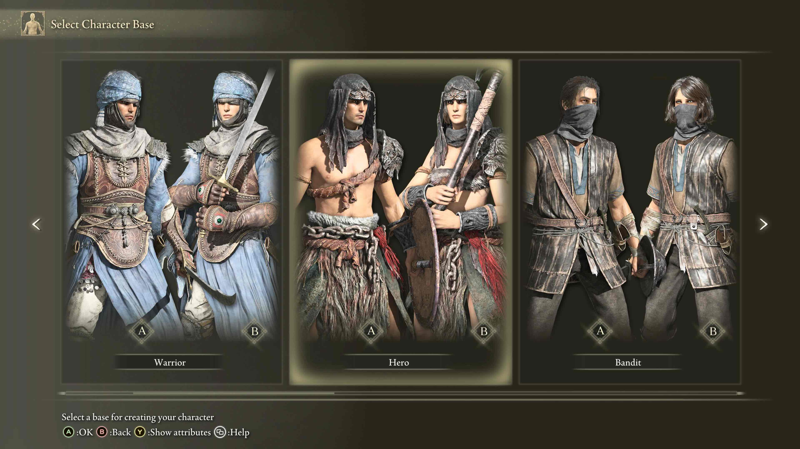

Why? Strength builds are usually harder, but you can respec (Start over and redistribute your attributes to new ones without penalty or progress) mid game and choose whatever build you like after you get a feel for things and spend some time with the game and have a better idea on how you will want to play. Speedrunners typically go Samurai for speed, but running through this game as fast as possible is actually incredibly difficult if you aren't well practiced. If you read online you'll often see beginners are told they should pick Astrologer as ranged magic attacks make this game easier, but in my opinion this is bad advice and it's much better to switch to this class once you unlock respecing midgame after fighting a necessary boss (Queen Renala). As a beginner trying to fight a magic boss as a magic user you'll find a lot of your attacks aren't very strong and the boss is fairly difficult and the game is very hard to progress. If you go strength build, you can get the Golden Halberd from defeating the first Tree Sentinel, and this weapon can carry you through the game easily. The Hero class is better over Confessor, as the easy way to kill Radahan with rot breath requires 12 arcane. You can also get strong Tree Sentinel armor without fighting any additional bosses. 

For a keepsake I would go Fanged Imp Ashes.

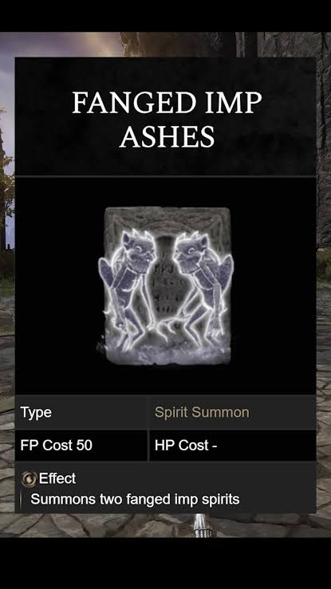

Why? Well you can really pick any or none of them as they all can be acquired later.

While an unusual choice, people really sleep on this summon as there are many to choose from. It lets you call two strong helpers at the start of the game to help you fight early battles and is a good choice to upgrade with the limited resources they give for you to upgrade things. It is honestly perfect for a beginner. When upgraded right it can do quite significant damage on a lot of the early game bosses. Choosing this option now saves you from walking 15 min to a vendor outside Raya Lucaria to buy the summon for 2k runes.

# Controls and Mechanics

- A(Cross) is jump
- B(Circle) is run
- Y(Triangle) is activate things
- X(Square) is use the item in your bottom left item slot. You can change these with the dpad up/down. You can equip different things into the slot.
- L1(LB) is block / left attack
- R1(RB) is quick attack
- R2(RT) is slow charged attack
- L2(LT) is a slow special move for your weapon, if one exists
- Y+R1(RB) tells the game to two hand a weapon, useful if you are under leveled for the weapon
- Holding Y(Triangle) and then pressing a dpad direction are other shortcuts you can program
- Jumping and then midair pressing B(Circle) is a good way to activate run mode without starting to sprint or rolling, useful climbing weird places or near edges.
- Start opens the menu to equip armor
- Back opens the map to fast travel
- Clicking in on the right stick locks onto an enemy

Often you will see random messages on the floor. They are meant as good faith messages from other players to give a multiplayer element to this solo campaign. They are moderated by FromSoft and only certain words can be used. You can turn these off. Sometimes they are useful and try to warn of long paths that don't have prizes. Most times they are just childish phrases like "no head ahead" or the classic "try finger but whole". Sometimes they are placed over items you are trying to pick up and an enemy will kill you as you try to grab or activate the item, this gets annoying quick.

White ghosts are other players playing the game, you can't interact with them.

Red ghosts and red tracks when activated show how someone else died.

The game tracks button inputs when fighting enemies. If the enemy senses you are struggling and you press buttons franticly it will likely tell the boss to instantly kill you. Which is a very cheap if you don't know about this. So avoid repeat dodging or healing right away after getting hit. You can also game this to your advantage and button mash when you are at safe distance and try to encourage certain moves from bosses you know how to counter or dodge. Rolling into a boss versus rolling away can help a lot on some bosses. The game also tracks when you lock on to an enemy and will trigger their defenses, sometimes it is best not to lock on. 

You are invincible while a door opening animation is playing, use this to your advantage. You are sometimes invincible when dodging, using a spirit ash, or getting on or off a horse. Look up i-frames in elden ring to learn more. 

Random and rarely walls disappear when you hit them.

## Opening area

Grab the item, head out, enjoy the scenary, take a left and die to the boss. If you manage to beat him (near impossible for a beginner) run off the ledge.

The key to defeating this boss is timing shield blocks precisely allowing you to perry, but this is not easy to learn and beating this boss will take a lot of unneeded practice.

## When you wake

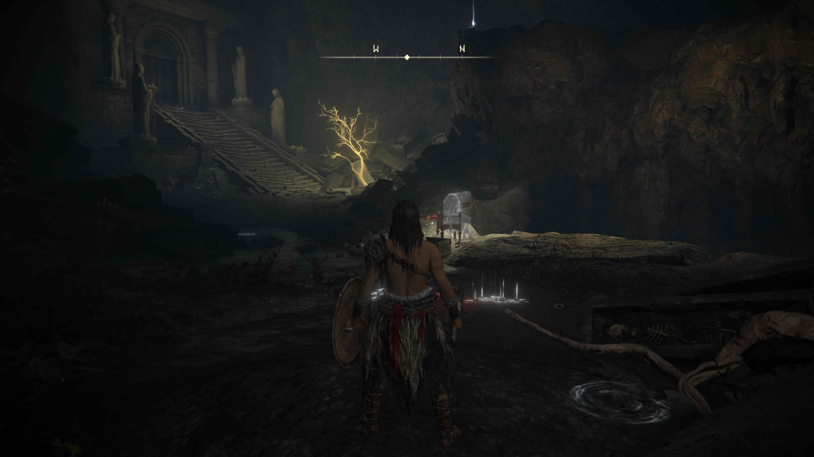

Immediately you will be given two options, if jump down the hole to the right of the yellow tree you'll enter the tutorial area which will eventually circle back to where we are now. If you open the door at the top of the stairs to the left you'll continue on.

Either choice is fine, the area is straightforward and doesn't take long, just keep running forward and fight the mini boss. If you skip it just know you skipped it poorly teaching you basics on pressing attack (rb) and charged attack (rt) and healing (down on dpad and X on red flask).

## The first grace

Once you make your way through the door you'll get to a grace.

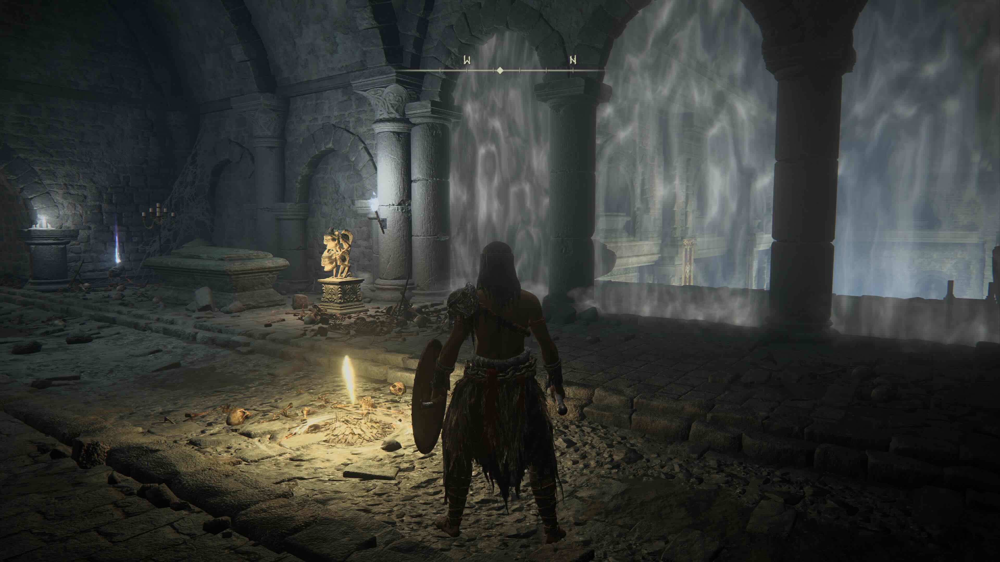

These yellow campfires are like save points, you can level up, perform upgrades. When you activate these you enable a fast travel point, if you activate them a second time or more you will sit down and the enemies will stop chasing after you and you can take a sigh of relief as you are safe. These are littered throughout the map. 

Grey walls like the ones seen to the right of the first grace require a one time use stonesword key to remove at the weird gargoyle statue. Sometimes they take two. This dungeon is fairly difficult, so if you chose the stonesword key keepsake I would save it and skip doing it until you level up quite a bit. 

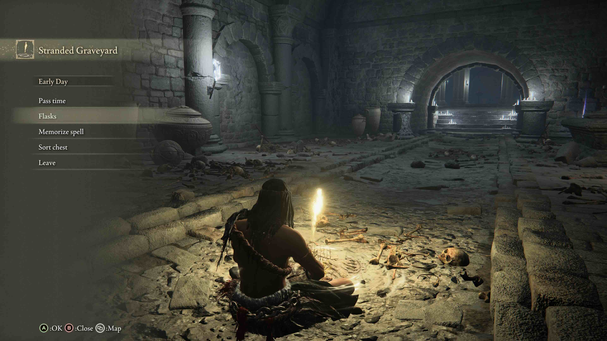

At graces you can use Golden Seeds to increase the quantity of your flask so you can heal more or replenish mp more. 

There are various destroyed churches throughout the game. They usually have an item that increases how much each heal does (Sacred Tears), you will need to talk to a grace to activate them.

Afterwards is an elevator, you need to press the giant pressure activated button on the floor to trigger it to go up.

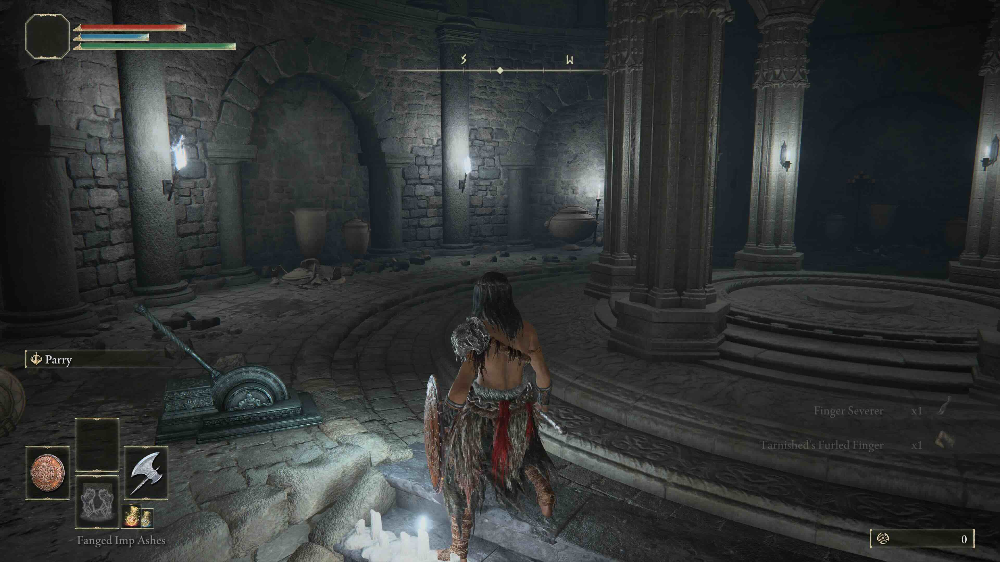

If you fall off the elevator you can use the switch to bring the elevator back down.

In some dungeons once you enable these buttons it makes a shortcut to the bottom of a dungeon.

## The first steps

Once at the top of the elevator open the door and take a look around. It's a beautiful game with a huge world map to explore.

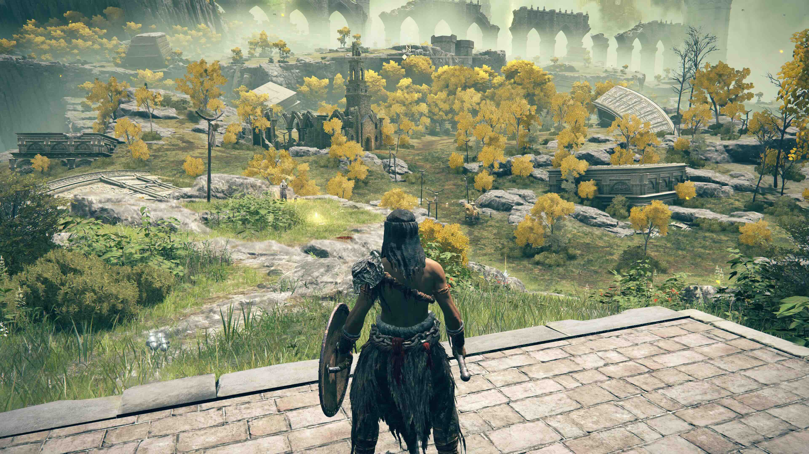

There's a guy straight ahead with a white mask that has a storyline to encourage multiplayer mode and yet another grace. You should talk to the people in this game as they have plenty of interesting dialog. I'm not a huge fan of the weird crucifixes. Feels anti christian and kinda creeps me out. It's what you would expect for a game from the creators of Dark Souls with the writing from George RR Martin.

The guy on the horse (Tree Sentinel) is a difficult boss many a player tries and fails to beat. I believe it's purpose is to teach the player that often times in this game you will be confronted with a boss you just need to give up on and go some place else until you get stronger. There's a sword and summon we can get that makes the battle trivial with a minor sidequest. 

The mini crucifix on the right is a multiplayer statue you can use to ask for help in this area. I skip that functionality this is a single player game to me.

If you open the map you will see a lot of brown fog and a small map. This will get much bigger as you explore.

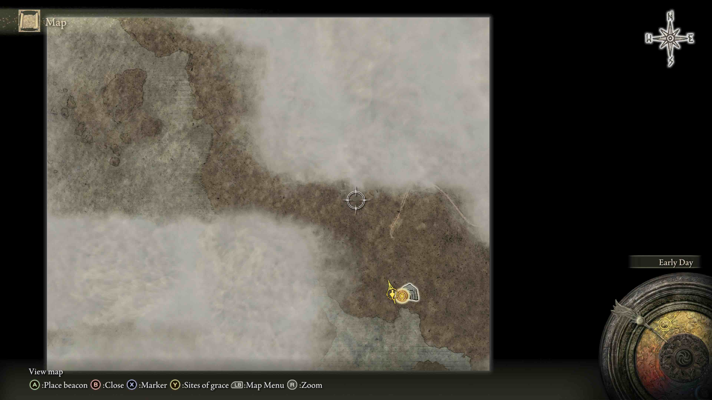

Pressing Y toggles the HUD on and off.

On the top left is a red bar which is your health.
The blue bar is how much magic you have.
The green bar is how much stamina you have.
The empty box will be used to indicate which great rune you chose that gives you a stat boost later.

If you spin around you will see the top middle compass change based on the direction you are facing. North, East, South, West.

The bottom right is how much money you have, if you die after earning money, you can go back and collect it from the yellow spawn near where you died. If you die twice in a row before grabbing it, the money is all gone forever so be careful.

Left on the dpad unequips and equips the shield

Right on the dpad unequips and equips the axe

Down on the dpad rotates through equips items that can be easily activated with X

Red flask heals hp, blue flask heals magic, Fanged imps can be summoned when you have enough magic and are near enemies.

Head to the church of elleh (helle backwards) and get to the next grace.

In the destroyed church there is a pedastal and a guy dressed as santa with a donkey. (Again weird anti christian vibes)

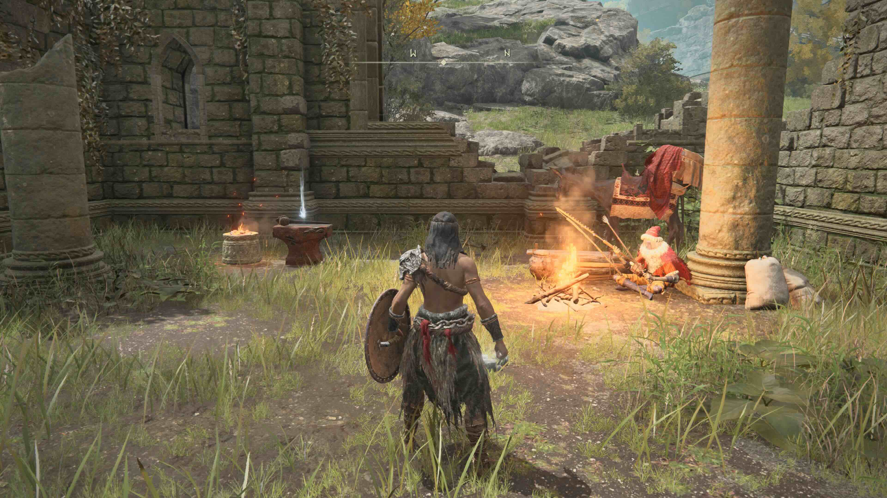

The pedastal is there to teach you that you can upgrade weapons. In order to do so you will need to find smithing stones. There are somber and normal smithing stones. Weapons use one or the other, but never both. Be extremely picky about what you choose to upgrade or you will be in for an extremely tough time.

Santa sells a handful of useful items once you have an abundance of money. He has a torch so you can see in dungeons, an almost useless telescope that lets you get a birds eye view of places, cracked pots which make it so you can craft items to throw at bosses to put them to sleep or poison them, and a crafting kit so you can follow recipes you find to make certain items, the rest is pretty useless.

All NPC questlines are really well documented in this [reddit post](https://www.reddit.com/r/Eldenring/comments/11lfopv/guide_all_npc_quests_endings_w_points_of_failure/)

If you look at the map now you will see an orange pillar.

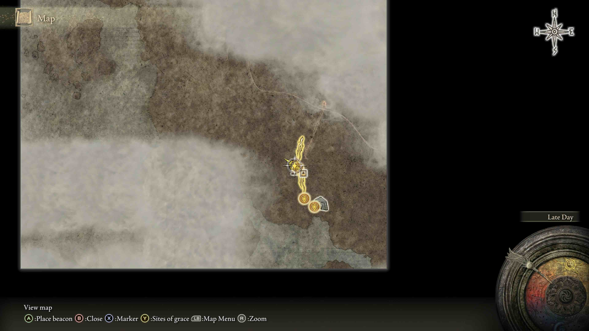

These are the locations of parts of a map so everything isn't all foggy and brown. You can mark it and it will show up on the compass and you can head that way. Once you get there you will be ambushed by some enemies, grab the map piece, then head up the hill and activate the next grace by the gate and sit down so you don't have to fight them.

It will turn night time and Melina will introduce herself. Accept her mission to go to the giant yellow tree and she will give you a horse. Press start go to equipment and equip the whistle ring to the item slot at the bottom by the flasks, so you can summon the horse.

While it is night time, press back and fast travel back to the church and talk to Renna the witch, she will give you a bell which allows you to summon the fanged imps.

Head to the grace and sleep until day time, then fast travel back to the gate.

Open the map

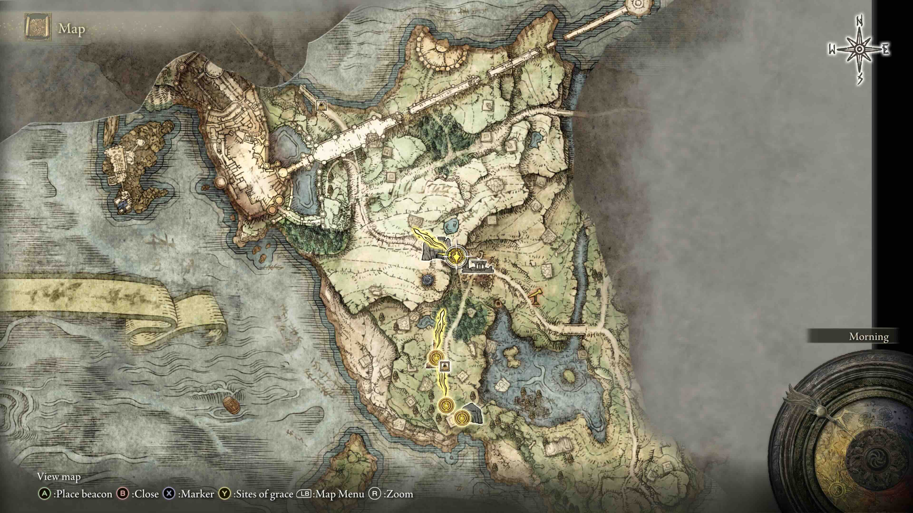

There's a lot going on with the map so let me break it down.

The yellow lines from the graces kinda point to nearby places you should go for storyline objectives.

Black circles are gaeols (pronounced jails for some reason), they usually have a mini boss fight in them and may require a key to activate.

The telescope will give you a birds eye view of the area.

The mini orange circle are usually cave entrances.

The top left is the first boss of the game. I recommend exploring the map and getting way stronger before trying to go in the castle and fighting two very difficult bosses.

There are various paths you can go to get to the next areas.

On the top of the map is a brown robe icon, this is a npc there to show you that there's a way around the castle by following the cliffs and sneaking into the next area.

If you want to head east there is a bridge into the brown fog.

South of the telescope is a T where you can go north to a East Limgrave or south to even more brown fog and eventually the Weeping Peninsula part of the map.

It's an open world game, but item levels kind of indicate the difficulty of the enemies. This area has level 1 items and easier enemies. South has level 2 items and harder enemies. Enemy difficulty is kind of a joke though and I strongly recommend just navigating the whole map on your horse picking up all the items and graces and running by and skipping all the enemies. Enemies will always be able to kill you in 1 or 2 hits even in very late game.

Most items you pickup on the map are one time. They never regenerate and if you use a consumable on a boss and die, you may never have another one again to retry. Be mindful when you use something.

Enemies respawn after every grace. Enemies can drop different items when you kill them, most weapons you get from an enemy have an incrediby rare 1% or less drop chance and you will spend a significant portion of time farming certain enemies if you find a video of a cool one you want to use.

## Limgrave

After debating life for a bit. Let's take a look around. You will see carriages.

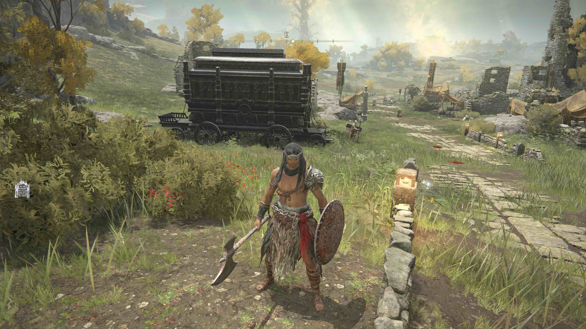

These have prizes on the front or back and are often carried by trolls. You can swing your sword on the troll to stop a carriage and then rob the chest and run off to a nearby grace and should. Practice on the first one and run back to the grace. This gives us the Lordsworn Greatsword, but we are not strong enough to use the sword until we get one more level in Dex. Sometimes you get lucky with two handing weapons (Y+Rb), but not this time. This sword is really strong against that Tree Sentinel we saw earlier and we can use it to do horse on horse combat against him and make the fight way easier. 

If you press start you will see status menu shows the strength of your weapon equipped, the axe has a damage of 141 and when two handed does 152. The equipment menu shows this weapon scales with Strength and Dexterity. The Longsworn Greatsword is at 81 because we don't have the Dex requirement and also scales with Strength and Dexterity. When we are level 11 with one point in Dexterity it will be 154 one handed and 161 two handed. Axe will be at 146/153. Meeting stat requirements matters a lot for whatever weapon you choose. The stats are very similar, but the real reason why this sword does so well against the tree sentinel is because it has a very long reach, way more than the axe. 

Most the damage in this game comes from upgrading your weapon and not from upgrading your stats in certain levels until late game. A maxed out +10 somber weapon will give you 800 damage on it's own, the remaining 200 or so damage come from levels. It's counter intuitive, but it's not worth dumping all your points into Strength to do more damage. I highly recommend just getting the stats you need to use your weapon and then focusing on vigor so you have enough health to be able to take some hits and not die to one hit all the time. Endurance helps a ton as well as it helps you do more consecutive hits and helps you wear much stronger armor.  

For now head to the middle of town and head down the staircase to a chest at the bottom at that gives you a charged move (L2/LT ash of war) you can equip to your weapon at a grace. You will need few different blades to be able to use different moves on different weapons, these are unlocked via certain chests throughout the map. Run outside and go south to your next grace. Rob the other carriage and come back.

Killing enemies gives you money, but its usually very slow and you are better off robbing all the graves to get your first levels. To get to the first graveyard run North through the gate following the road to shack with the next grace. Grab the golden seed off the yellow tree on the way. Your horse can double jump over barricades. If you click in on the right stick you will jump off the horse easily.

Use the seed to level up your flask. Turn around and grab the stone sword key off the body.

Talk to the lady to start the summons questline so we can level up fanged imps later.

Head south and you'll see a guy sitting in a chair in a field with smithing stones to upgrade our weapon. You'll see random chairs throughout this game, they usually have good item drops next to them.

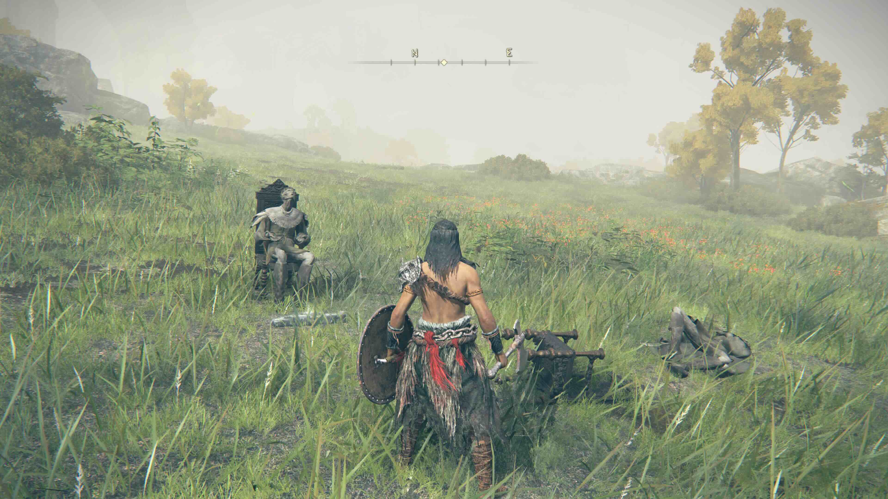

Head northeast and you'll find the first graveyard with money you can rob. Collect the money, you can do so from your horse. Get in the habit of double tapping Y on items to dismiss the item box near enemies.

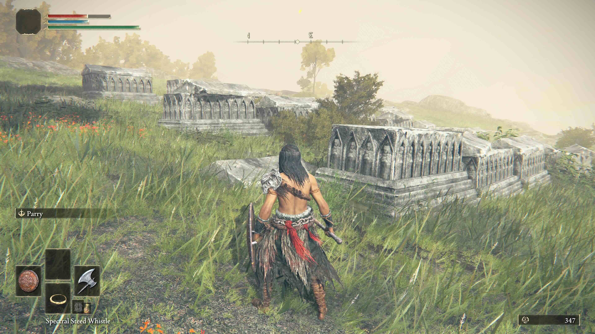

Northeast of here is another shack with a grace with a guy (Bernahl) who will sell you various ashes of war. You don't need any of them. Press start to open your inventory and use 4 gold runes until you have 800, so we can finally put one point in dex and be able to use the Lordsworn Greatsword more effectively.

Fast travel back to the first shack (stormhill).

Head northeast and run past the troll to a water basin (crystal tears), these have materials for another one time use flask you get later.

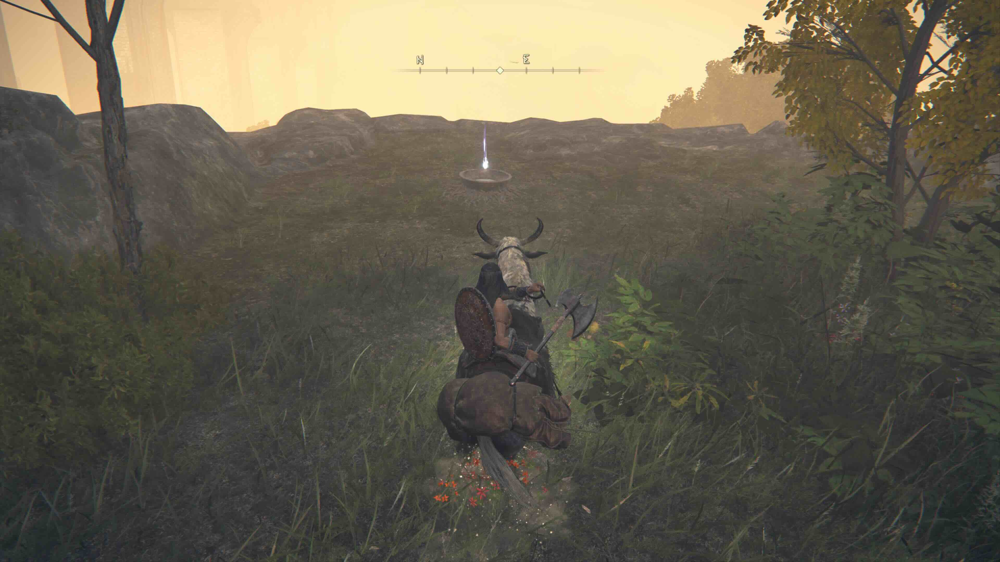

Keeping heading straight off the ledge, you will see these giant steps you can walk onto. They are added to descend tall cliffs on various parts of the map.

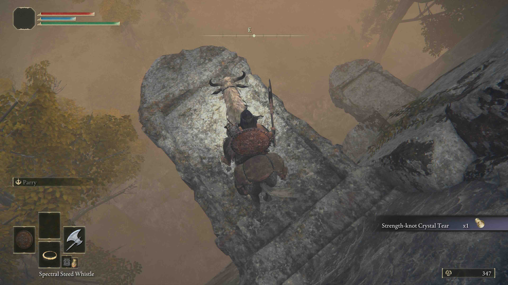

Once down head south back to the second shack.

Head east and you will find a camp with a lot of enemies who want to kill you. Optionally to the left there's a giant chest with a nice shield. Just north of here on top the cliff is a horse enemy you can practice fighting, LB/L1 to attack on the left side of the horse, RB/R1 to attack on the right. If you beat him you get the golden vow ash of war which increases your attack damage by 15% and decreases damage taken by 10% for 80 seconds when used. I wouldn't add this to the axe as it changes scaling from D tier to E tier and the axe is very heavy. From here we can make our way to the lance on top the building in camp. Keeping going east following the road to the next grace. Someone will ask for help, head back and up the cliff to the south to find a giant pot (Alexander) on the edge and hit him to help break him free.

If you kill him you can get a item that weakly buffs attack damage when equipped. If you do his questline and wait till the end of the game it rewards a stronger version and I recommend waiting.

Go north of here and you will find a cave off the cliff with a door on it and a grace inside. This is a catacomb (Deathtouched), you cannot fast travel from within these, you have to go outside. These always have a mini boss at the end usually behind a door you have to unlock. Its a good idea to rob these for grave glovewart and other items. This one has grave glovewart 1 which can do the first upgrade to your fanged imps and has a nice sword. Run around the skeletons collect stuff, pull the lever and go back to the grace.

If you want to fight the mini boss yellow walls indicate mini bossess are in the next room. The imps can take care of this boss no problem and it's good practice to learn how to help them and gives a decent amount of runes you can use to upgrade strength. Jumping (A) and then attacking (R1) and running or rolling away (B) works well.

Head back to the grace, on the right of the bridge is a spirit spring you can use to get down.

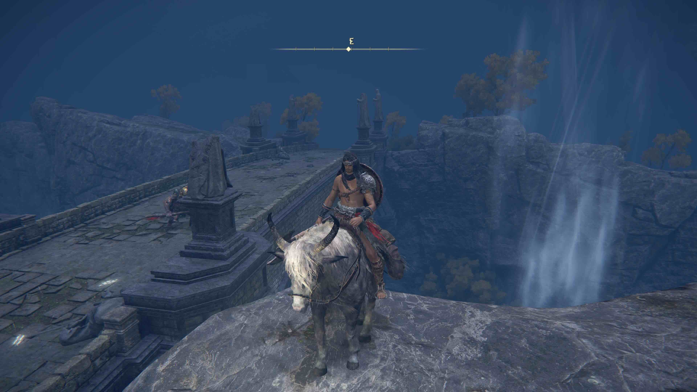<photo>

You can jump off the cliff to the bottom of these and as long as you are in the wind you will not die, you can also jump in the spring and come all the way back to the top

Nearby is a glowing ball enemy, they usually have good items when killed.

Near the grace is a guy asking for help, you can hit him free, but don't kill him and fully finish his questline throughout the game if you want an item to make your strength build stronger.

From here I could go step by step go through everything, but I recommend exploring the entire map.

Avoid going to the top left castle of the starting map as this is where the first real boss is and just see how far you can explore everything. Enjoy the beauty of the game and just take it all in.

Rob all the graves.

Visit all the churches.

Collect all the map pieces.

Collect all the golden seeds on the map.

Collect all the water basins.

Here's a good [map](https://mapgenie.io/elden-ring/maps/the-lands-between).

There are bosses at the bases of the giant trees that are very difficult to fight, avoid them.

There are portals you can talk to that warp you to different parts of the map. You can always fast travel back so there's no harm in taking them.

There are occasional trap chests that when you open that will take you to different parts of the map. Rest at a grace to fix fast travel afterwards.

I would recommend avoiding all the dungeons and battles for now and just run around on your horse and get stronger first.

There are occasionally blue towers sometimes with small puzzles you should solve, it's worth climbing a couple to be able to equip more spells at once, but as a strength build you really have little use for them.

Armor means almost nothing in this game and is mostly cosmetic. You can't upgrade it.

Weapons should only be upgraded when you are absolutely certain this is the weapon you want.

Doing so will require either somber or regular smithing stones. Somber weapons are way easier to level until you have access to easy to grind money and the smithing stone bell bearing 1 and 2. Remember spend money and stones very carefully or you will be in a for a rough time of grinding low level enemies.

If you keep heading east from the Saintsbridge grace you will find a purple boat boss that is tough, skip them, then a church with an enemy that will ambush you that you can also skip, these exist at random places throughout the map and it's best to run away until you are very strong, then keep heading east and you will enter this red area of the map called Caelid where all the enemies are super strong and everything will really try to kill you. I would just keep running till you find the Rotview Balcony grace and rest. This area is great for finding lots of money to get stronger.

Now that we finally explored outside the main area. Melina thinks we're cool enough to join the roundtable and we can talk to a bunch of npcs.

There's an item shop here where if you decide to kill a vendor on the open map you can get a bell and buy their items here.

You don't need to waste the money on anything.

There's a blacksmith who can upgrade your weapons even further than the first church we went to.

If you go back to the telescope in the first opening area, follow the road south and then make your way north east into the fog and eventually you'll end up at a church (Third Church of Marika) with a new flask and you can mix the various water basins you found.

South of here is a map piece and next to it is a elevator to a whole underground world. Feel free to explore and touch all the flames, but don't bother fighting the boss as it's super tough and we are way under leveled. You can fast travel back to the surface by by clicking in on the right stick to open the surface.

At the very north east of the map there will be a lift (Grand lift of dectus) that takes you to the next area and in order to unlock that you need to retrieve two halves of a medallion from the top of two forts (Fort Haight West and Fort Faroth).

One half is just further south of here on top fort haight.

The other half is all the way east in Caelid by the giant dragon on top fort faroth.

The Liurnia part of the maps is available by going past Finger Reader Crone North of the Stormhill shack.

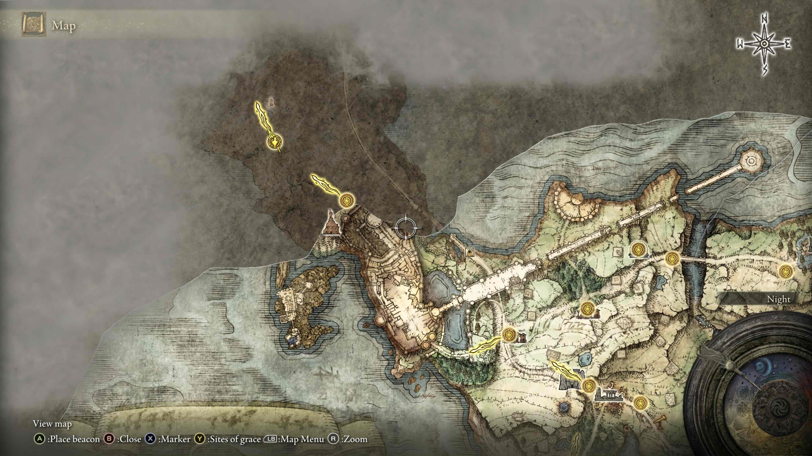

After rising up the second lift all the way to the north east of here is another tree sentinel boss you have to beat to get to the next area and he is even tougher than the first and you will really need to level up to beat him.

Spend a few hours exploring the map and planning out what caves you want to go into, talk to all the npcs if they don't attack.

I recommend getting all the map fragments, golden seeds, both halves of the dectus medallions, and visiting all the churches you can.

There are a number of guides out there on how to do so, if you don't know where they are, or just want to follow an optimal path someone made with minimal time investment. I recommend this one: https://www.youtube.com/watch?v=lxfZdm6PO0I Skip the end part in getting 150k runes as you should use gold pickled fowl foots and the golden scarab to get even more runes and save yourself some grinding and annoyance. I'll explain it later.

Here's what the world looks like with the bottom half explored.

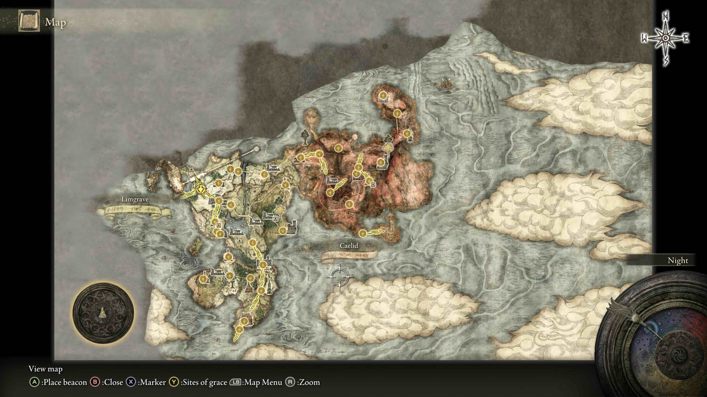

At any point if you get bored and just want to progress the story line, head back to "The First Step" grace and we can take on the tree sentinel. This guide will walk through as if you haven't explored anywhere.

## First Tree Sentinel Fight

The tree sentinel is very tough and you will likely die if you just went to fight him head on. However there is actually a very easy way to kill this guy even at the starting level without really exploring. We have the Longsworn Greatsword from the first carriage and we can use it optimally with our Dexterity at 10. This boss is also weak to rot and there's a summon we can easily get that can poison him (rotten stray ashes). Together this makes this fight trivial.

Head east of the first step grace into this destroyed village. Down the steps in the basement is a trap chest that warps you to a region of Caelid, once teleported run down the cave to escape to a grace at the entrance. If you head south you will find a large lake of rot that will poison you if you go in it, if you keep heading around it there is a rotten stray ashes summon on a body in a broken building, then keep following the lake around to another grace.

Optional: fast travel back to the very first church, buy the crafting kit. Press start, open item crafting, make rowa raisins out of the red rowa fruit that can be picked up around the church if you haven't grabbed some already. These heal your horse slowly.

Fast travel to the first step, equip the rotten stray summon, equip the raisins which can be used to slowly heal your horse, equip the lordsworn greatsword from the gatefront carriage. If you don't have the radagon sorseal equipped from Fort Faroth it will have a red x on it indicating you aren't strong enough to use it effectively, sell runes and put one level into dex and then press Y+R1 to two hand the sword. The X should go away when at 10 Dex. Mix the strength knot from the very first water basin into the physick if you have it (not needed) to give an extra +10 strength.

If you want to make the fight even easier sell your runes and split your stats between vigor and strength. After the fight you will get a halberd that requires 30 Strength, 14 Dex, and 12 Faith. To add to the build you will use the finger seal, requiring 15 Faith. Further adding to the build, to use rot breath you need 12 arcane to easily kill a future boss Radahn (this is why I recommend hero over confessor). Lastly from Forth Faroth you will get Radagons Soreseal which boosts vigor, endurance, strength and dex each by +5 at a cost that you take 15% more damage which pairs really well early game. For the easiest time future points should be split between vigor and endurance until you feel strong enough to tank hits and able to walk around without being overloaded in good gear. You can spend some points in strength for extra damage if you want, but it's really not too beneficial past 30 and it's way better to just upgrade your weapon if you want to deal more damage. 

Hop on the horse, walk up to the tree sentinel, summon the rotten stray ashes, drink your physick. Sprint into the tree sentinel and press r1/l1 to attack. Let the dog take the aggression. After each hit, sprint in a circle and come back sprinting into the sentinel and do it again. Eventually the dog will poison the tree sentinel as indicated by red smoke and you can run and sit on top the small building to the right until he dies from the poison without worry of the sentinel attacking you. This might take a few tries. Heal when you need to. You need to distract the sentinel from the dog enough so it can attack enough to inflict poison.

If you are truly stuck you can ask for help and summon a random multiplayer cooperator on the internet at the statue and you might get lucky and have someone kill him for you.

The tree sentinel drops a Golden Halberd our weapon of choice for the playthrough. It upgrades with Somber Smithing Stones which are way easier to come by and make early game upgrades. The halberd also has a golden vow L2 temporary enchantment to buff attack damage and damage negation. Getting a +3 Somber requires exploring north of Limgrave unless you want to rely on a very rare random drop in the selia cave you got teleported to. We can easily upgrade to somber 5 without too much difficulty. Getting somber +6 requires both halves of dectus (easy) and climbing the long ladder near the top left of the map to a chair overlooking the map or going to volcano manner early via a storyline death in raya lucaria and doing some long navigating to get to a grace to fast travel out (longer), +7 requires getting past the next tree sentinel or fighting an even harder dual boss fight in a cave underneath the tree sentinel.

## Leveling up 

If you haven't made it to Caelids Fort Faroth, head back to Selia Under-Stair by the rotten stray ash summon, light the three towers in town, then leave north and head up the hill to the church. Take the spirit spring to the fort to the north. In the fort run inside and up the ladder and grab the medallion. Turn around and jump into the hole and find your way past the rats and down to the radagon sore seal and equip it. It's on the floor and was the item you saw when you first walked into the fort. 

The radagon sore seal boosts our stats 20 levels giving us +5 vigor, endurance, strength, and dex.

If at this point you still need more runes to level to use the Golden Halberd, there's an easy grind.

Head northeast until you get to the giant tower called Lenne's rise. Head West down the hill on your horse. You'll see a flash of light and a giant ball spawns in behind you when you are near the cliffs edge, immediately take a hard 90 degree right. You'll dodge the giant ball and earn 2k runes. Go back to the grace and repeat. Do that a few times and you should be able to level until you can one hand the Golden Halberd.

If that feels cheap you can also grind other enemies around here if you wanted to.

You'll want 30 strength, 15 faith, 12 arcane, 14 Dex, and at least 18 vigor. 

From here you really need to decide how much grinding do you really want to do? You don't have to grind to get runes if you are willing to do some side quests to earn runes.

Head back to the first steps and behind the church jump off the cliff to the spirit spring and get the gold pickled fowl foot. Then head to Agheel Lake North head south and cross the bridge and grab the gold pickled fowl foot by the not crucifixes.

Optional Mission to Kill the black horse (Knights Calvary) in Caelid:

I'm going to keep it 100 here, this is very much an end game area and the guy is meant to be fought at end game gear. There are so many different ways and tricking the horse to play nice and jump off the cliff isn't easy. It originally took me hours to learn how and it would have been way faster to just farm 60k runes from balls. https://www.youtube.com/watch?v=9CBCVE-chko

Head back to Lenne's Rise. Pass time until nightfall.

There's a black horse here who has an insane amount of health and is really difficult to fight, we want to kill it.

The easy way to kill the horse is to convince it to jump off the cliff. This is not a glitch and was an intended mechanic otherwise it would have been patched by now. There a lot of different videos on how to do so and it will take a while to learn a setup that works for you. Just be sure to use the gold pickled fowl foot after he dies and before the runes show up to earn an extra 20k runes. While this is not a glitch this is a not a easy trick to pull off. So don't worry if you can't or don't want to do it.

Optional upgrading fanged imps:

At the bottom of the map in weeping peninsula, just south of the church of pilgrimmage there's an arch with an entrance to the tombsword catacombs with a grave glovewort 1 and 2.

North of the rot view balcony behind the giant tree is a cave with grave glovewort 3/4/5.

Head to the round table hold and talk to the red robbed girl by the fireplace and talk to the black smith multiple times about her. This opens a shop next to the blacksmith where you can upgrade your imps in exchange for the glovewort and some runes.

Optional Mission to get the golden scarab:

You'll need either bloodhound step from killing the black horse or the quick step ash of war.

To get the quick step ash of war, travel to warmaster's shack from earlier (just north east of the gatefront) in limgrave and buy quick step for 800 runes. Then travel to the round table hold and buy a dagger for 400 runes from the shop. At the grace you can equip bloodhound step/quick step to the dagger.

Fast travel to fort faroth, follow the orange wall west until you see a dragon and a scarab together, right below them is a cave entrance.

Equip and two hand the dagger (Y+Rb). Run straight and to left into the river of rot and use bloodhound step/quick step (Left trigger) to travel across faster and not get fully poisoned. Head left then run forward and right until you get to the boss. The imp summons are very useful on this fight and help a ton with distracting the dual boss so you can kill them one at a time. Be aggressive to prioritize killing one asap while the imps are still alive. This is much easier when your sword is upgraded and you are higher level. After beating the boss you earn a golden scarab which is a gold pickled fowl foot you can equip last second after beating any boss and stacks with gold pickled fowl foots to get even more runes.

Optional Mission to kill the giant dragon:
From the original carriages we robbed by gatefront there is a flail that does bleed damage. It's kind of slow to inflict bleed, but can do the job.  
South of Limgrave in Weeping Peninsula is another carriage with a morning star, this one works better at inflicting bleed. 
Equip the morning star with two hands (Y+Rb) and then equip the golden scarab and have a gold pickled fowl foot in the action bar ready to use.
Fast travel to Fort Faroth, walk up to the dragons back left foot, and keep tapping Rb until it dies. Bleed will build and do a large percentage damage. When the dragon dies use the gold pickled fowl foot and get 115k runes. Without both these buffs you will only get 65k runes.

There's a glitch to be able to repeat farm it if you go back to the grace fast enough. I'm not a fan of 5 min of pressing Rb so I usually don't bother. 

https://www.youtube.com/watch?v=TQjR4axsl6k

Optional glitch to kill another dragon:
Back near lenne's rise there's a long bridge, there's a glitch to kill this dragon and get 100k runes by luring him to the end of the bridge and having it float in the sky near the tree until the game kills him for you. This glitch is way easier than convincing the knights calvary to jump off the cliff in my opinion, but can take some luck. 

https://www.youtube.com/watch?v=p7VmiX50vO4

There's also some more optional gear we can get to make this build way better.
This is all way overkill, but this makes the next bosses way easier.

- Pickup the jellyfish shield next to foot of the four belfries grace with a contagious fury damage buff L2. (West of Raya Lucaria in North Limgrave)
- Head south of rotview balcony in Caelid to the fort, on the south side of the fort at the base behind two enemies is the flame grant me strength spell which gives a damage buff.
- Head to the round table hold and buy a finger seal, with 15 faith we can use it to cast poison mist and rot breath with 12 arcane. 
- South of castle morne rampart grace in weeping peninsula on the left is a scarab that gives you poison mist, equip this, this can be used to kill tree sentinel 2.0 easily
- Upstairs of sofria river well is a water basin with a spiked crack crystal tear, next to it is a bear in a village, underneath the bear there are stairs to a basement with the axe talisman, equip this.
- Mix the spiked crack tear and strength tear in the physick at a grace
- Gear: Underneath the second tree sentinel is a [dungeon that has easy to grab tree sentinel armor](https://www.youtube.com/watch?v=QHsFlF63vns)
- In southern Caelid is a church we can trade dragon hearts from killing a dragon for the rotten breath skill 

## First two bosses

When you are ready you can head into the castle northwest from stormhill shack grace and face the first boss without too much struggle.

This boss should be possible even with a +1 halberd and not doing any of the optional rune farming or upgrading your imps.

To make the fight easier you can get the Margit shackle for 5k runes. Just east of the telescope in Limgrave is a cave. Inside the cave is a mini boss called Patches. Kill him and use the bell bearing at the two sisters in the round table hold to buy the shackle. When used during the Margit fight it traps the boss for like 5 seconds and gives you plenty of time to just wail on him. 

For additional help I would summon the sorcerer rogier (ai helper) at the yellow summon before the battle and cast your fanged imps immediately at the start of the fight. 

After defeating the first boss, head to the gate, talk to the guy and go through the front door storming your way into the castle. You basically want to [run all the way to the North East](https://www.youtube.com/watch?v=1mBdjb-jQFI&t=53s) and get ready to fight the second boss. To make life easier if you follow the left side when running in and immediately turn around there's a grace right above the entrance. 

Before fighting this boss I recommend getting a +5 golden halberd and +5 fanged imps. I also recommend doing a quick sidequest to unlock Nephelia who you can summon to help you fight the boss. From the grace before the boss turn around run past the troll and to the right of the golden seed there's a entrance with a female hero class npc. Unlocking Nephelia now and using her helps a lot for later on to track her down when doing Seluvis's quest. 

Now we can take on godrick the grafted

Use the npc summon to get help against boss, cast contagious fury, cast golden vow, use physick, step in side and summon imps. Run up and do some jump R1's and charged R2's. When he dies equip golden scarab for extra runes.

After the boss you can head east of stormveil castle along the long bridge path and get the Godrick great rune, you can use rare expensive consumable rune arcs to get a stat boost until you die. I'm not a fan of burning consumables like this so I don't use it often. You can also keep heading North and it'll take you to Liurnia. 

Next up is the raya lucaria castle. It's in the middle of Liurnia, you need to [get the key](https://www.youtube.com/watch?v=zy5em746nAQ) from behind the magic dragon west of the town. You do not need to kill the dragon. The Castle itself is very easy as a strength build. It's [linear](https://www.youtube.com/watch?v=f4jBaPFZAXM&t=174), just run through, make your way up, kill the red dog, then the queen. After killing the queen you get the ability to change spec with easily available [larval tears](https://www.youtube.com/watch?v=VauyWwBwiHA) and leave the strength build if you want and switch to something like a [magic build](https://www.youtube.com/watch?v=pi7eXTxb0vw). I would recommend against it though unless you love exploring as you will have to get a ton of different items.

After Raya Lucaria, with two halves of the medallion you can go North East to the Altus Plateau and onward to the next tree sentinel (far north east). In this area you can also get a [+6 somber](https://www.youtube.com/watch?v=Au-l_deU86o) to upgrade halberd from a stone on the cliffs on the top left of the map on a guy in chair after climbing the first really long ladder if you haven't already. 

Optional Grind for better levels and +10 Somber:
South of raya lucaria is a church with the white masked man, talk to him and do his questline to get a severed finger.
Head to the top left of Altus Plateua, East of the bridge of iniquity grace at the top middle of the map in the new area is a village of rot dogs and a red summon. Activate the summon and fight the mini boss.
This is a really tough fight, I recommend just being very aggressive, swing your sword before he gets to you to intimidate him, you need to beat him to progress the questline and then you can head back to the church.
Where he gives you a white cloth that needs a maidens blood, head to the bridge of sacrifice in weeping peninsula, and kill the girl to the south on the log (Depending on when you come here she may not be there anymore and you will need to go to the church east of the dectus medallion lift), then head back to the church south of raya lucaria, and receive an item that takes you to an area with the best rune farming in the game.
Use the item to teleport. Then head east then south and get to the grace at the top of the hill of enemies. To easily get runes, use a bow to trick the giant chicken birds to [fly off the cliff ](https://www.youtube.com/watch?v=aZvMUoak-v8&t=11) giving you 20k runes each with buffs. Gold feet can be made from a recipe from Patches. A bow can be bought from the round table hold. Arrows can be bought from Santa. This is by far the most efficient farming method until you beat the game. Additionally there's a +10 Somber in a chest on top Mohgwyn Palace you can just run up to once you get here and along the way are some high consumable runes found on the ground.   

## Tree Sentinel 2.0

In order to get to the next section we need to kill the next tree sentinel that is at the top right of the map.

You can try and fight the guy, it's a fairly tough horse vs horse battle, but doable with some patience.

Or you can simply crouch and walk through the trees and get behind him, then using poison mist (from weeping peninsula scarab) to drain all of his health before the battle even begins and you are never noticed. Each time it runs out just recast, this will take about 10 min and 10 casts, requiring multiple magic flasks, but it will eventually kill him. This is not a glitch, this was an intended kill otherwise this also would have been patched. There is also a trick to get him to jump off the cliff as well like the nights calvary, but this one doesn't seem intended to me. This requires using consumable throwing knives to try and bait him to the cliff and pushing him off.

After defeating the second tree sentinel and having defeated these three main bosses gets you access to the capital where you can get a +7 Somber stone in the sewers and finish the upgrades to +9, +10 if you have Mohgwyn unlocked.

From here nothing really stops you from bum rushing the next set of bosses like a speedrunner and going to beat the game. You have an optimal build with an upgraded weapon.

There's plenty of the world to explore if you are brave enough. I recommend going back and exploring a lot of the game and dungeons you have skipped now you are strong enough to not get bullied in them, don't worry it will still be really difficult. Look up some build guides on youtube and see if you find one you like, you should have the ability to get all the items you need to make any of them happen at this point without any difficult bosses in the way. If you want to stick with the strength build I would go get the mimic tear summon and upgrade it to the max with ghost glovewort 1-10. Fanged imps can hold their own, but they have nothing on the mimic tear even after it has been nerfed to oblivion. The first step to do so is going to go kill radahan, it's a semi difficult fight if you don't grind levels, I recommend using the dragon hearts from killing the big dragon and learning rot breath. Eventually you will find a third tree sentinel before a main boss who drops armor. I recommend switching to this armor completing your tree sentinel build.

For the guides continuation sake let's go get our +9 weapon and then head on to kill Radahan and get the mimic tear.

From the entrance of the elden city you want to run this route and get to the grace. Make sure to go left of the giant enemy that drops near the end of the red line. The yellow line continues to the next boss after climbing the dragons wing (dotted line).

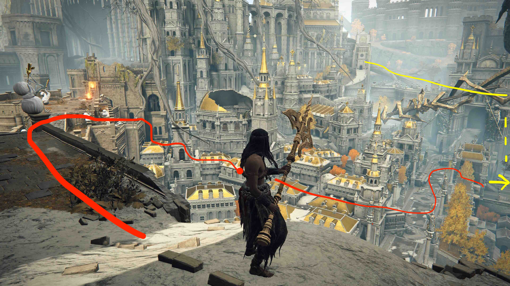

From the red line end. Continue northwest until you find a well under the dragons wing and head down inside.
Open the gate, run past the rats, open the door, jump down to the left and get the Underground Roadside grace.
From the grace head northeast and take the ladder down.
Jump on the giant pipe, run south, and then drop down to the lower pipe, and down again in front of the crab to the ground with the long awaited somber +7 on a body, inside the pipe ahead is another +7 somber.

Get out of here and upgrade your weapon.

Near the dragonbarrow map piece in caelid there's a Dragonbarrow West grace.
Next to here is a scarab to the North by the giant tower you can kill with a +8
There is a +9 here as well at the base of the giant tower.

Progressing in the capital city requires fighting two pretty hard strength bosses, I would recommend getting and upgrading the mimic tear first which requires killing Radahan.

## Optional exploring

If you haven't explored the rest of the map now is a good time.

Get all the map pieces.
Collect all the golden seeds you can. You can get a 11 flask uses pretty easily, the later ones are harder.
Visit all the churches you can. Should be +8 on your flask.
To the north west part of the map requires you climb some really long ladders, but is a linear path to the last map piece.
There's all kinds of bosses and dungeons, most will require you lookup a video on how to kill them or what to do.
The build is mostly complete and is as strong you'll likely get, so do what you want and then head on to Radahan.

On the very Northwest part of Liurnia is a castle (Caria Manor). You can run through it and get to a boss battle with a mage/strength boss called royal knight loretta. At +9 it's very easy. Early in the game, this boss is fairly tough. There is a glitch to easy kill her though at level 1, just watch a video if you would like. After the boss there are three towers, you can run by the dragon and get to ranni's rise. There's a whole mage questline here, it's worth getting the missable magic scorpion charm from it if you decide to go mage. We can't start it until we kill Radahan, but it's worth grabbing the grace for fast traveling. You can glitch your way into the next area with some interesting tree jumping and a few hours of practice, but as a normal playthrough it's not worth it.

In the Raya Lucaria Castle, you can take the lift down to the bottom and die to an abductor enemy which will take you to the Volcano manner questline. There is a +5/+6 somber here as well we could have gotten earlier, but progress will be stopped by a really tough boss in a church that prevents you from continuing the story and getting another +7. It is weak to sleep pots and there are level 1 speedrun guides on how to beat him. It sounds easy and doable, it's hard. IMO at this point the whole questline can be skipped without really any repurcussion.

If we go back to the Sofra River (South of the third church of marika in East Limgrave and down the elevator). We can light the 8 statues and fight a giant deer boss (optional) and make your way to the dragon kin soldier face down in the water from a portal. With a +9 on the horse he's not so bad, but he can and will easily one shot kill you.

Eventually if we come back here after Radahan we can take a teleportation casket and make our way to a extremely tough double gargoyle fight (even at +9 lvl 60). We could also walk through and spend our stonesword keys to unlock a lift to caelid, but it's a waste since we've already been there.

From here there's not really much we can do without killing Radahn or progressing the harder IMO capital city bosses.

## Radahn Fight

Radahn is very tough boss, but thankfully he is also weak to rot.

In the southern part of Caelid there's a church on the hill, head there and touch the grace. In the church is a red fountain where you should trade a dead dragon heart from killing the big dragon for rotten breath. This moves requires 12 arcane and is why I recommend the hero class over the confessor class.

Head southeast of here and you'll find a tower at the Impassable Greatbridge grace with a portal. Take the portal into the castle and make your way to the Jester that is talking about the great battle.

Once in the battle you want to run forward, this will cause the arrow to hit the sword and summon the three people, run to the right and the arrow should hit the sign and summon those, summon the horse, take a hard 90 degree left and summon the other figher. Have them run in and distract the boss. Dodge all the arrows using well timed sprinting when needed, hopping on and off the horse or dodging rolling work too. Hang back for a bit.

Once the boss is sufficiently distracted sprint your way to the top of the hill and cast dragon breath (Left to select finger spell, 2 hand the finger spell (Y+LB/L1) then to use press and hold RB/R1). It should hopefully take and he'll start smoking. Run away and resummon people on the top of the hill when they die. At half health he'll fly up and come crashing down again. Sprint to the side to dodge him as he comes back down. You need to re poison with dragon breath until he dies. If you are struggling the golden halberd at +9 can take him on too and make the damage happen quicker. Optionally equip the golden scarab and use a pickled fowl foot when he dies for 100k runes.

Each time you kill a main boss they drop a item that can either be traded for 1 of 2 new boss specific gear at the Table of Lost Grace or used for extra money. On the south most part of the map is a giant land turtle by the fourth church of marika. If you knock off the barnacles it will fall and you can duplicate a single boss rememberance. Duplicating the Radahn rememberance gives you an extra 40k runes each. If you want both the items just farm runes, but free extra runes are useful at this point in the game. There are other giant turtles around the map as well.

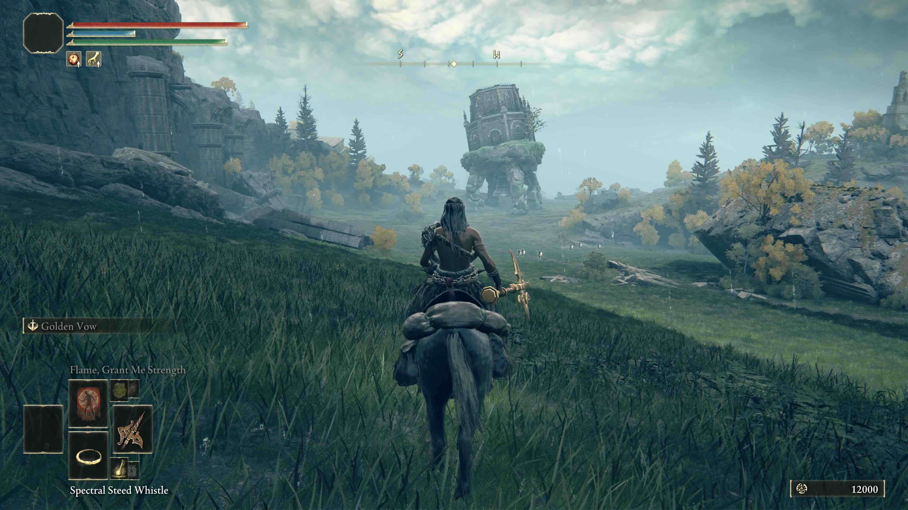

## Mimic Summon

Killing Radahan summoned a giant Meteor tha destroyed part of the map. The game places a marker left on the map left of Fort Haight West so we can go get the mimic tear. Head there and make your way down to Nokron. Keep heading forward and drop off ledges until you make your way to a grace.

On the south side of town is a larval tear which is a consumable you can use to respec your character and change how you spent your levels. There's also a skeleton ashes, a lot of people like these instead of imps as they have 5 enemies to kill instead of 2.

Exit the town to the east and make your way to the golden fog gate. Take off all your gear and clothes. Head inside, activate the boss, then quickly re-equip it all starting with the halberd. This is the mimic tear fight and he will have a +9 halberd to hit you with if you have it equipped entering.

Head north and then west to a new light the fires challenge. At the second fire statue is a path that takes you to a grace and overlooks a city. Notice the bridge from the right side of the city to the left side. Follow the roofs south to two enemies, skip them and take a left crossing into another part of the city.

There's a stonesword key wall on the far side with the mimic tear summon in the chest. Grab it. Exit the church to the south and grab the other grace. North of here is a chest for Ranni's questline and a portal back out of this city to the fire statues.

This is optional to the Rani questline, but while we are here. Light the 6 statues and fight the next deer boss. Easy at +9 avoid his magic spell on the ground, it wrecks the imps. Buff up before the fight. This isn't a super easy boss, but shouldn't take too many tries just dodge his main attack and counter.

Now you have an option do you want to fight a really tough boss at +9 or do you want to do Rani's questline. I recommend Rani's questline.

Hard way: Go to Ancestral Woods, head North to the jellyfish and hop off the ledge. Keep going north and you will get to the twin Gargoyle fight. At half health the second gargoyle spawns in. He also likes to use a poison attack that will kill you. The gargoyles are able to hit you from further away than you can hit them with the halberd which makes the fight even tougher. If you win you get access to a casket that teleports you to the deeproot depths which you can run through to another coffin which takes you to Ainsel river well.

Or we can just portal there from Rani's quest.

Head back to Rani's rise and talk to her at the top since Radahan is now dead. Head downstairs and talk to iji and seluvis to unlock fast travel again. Go to seluvi's tower which is outside and to the right.

Do not pass go. Do not collect $200. If you want the magic scorpion charm which is very useful for a mage build you need to be careful what you do next and finish seluvis's questline before he dies. This questline changes what you have to do depending on how far you are in the game.

When you talk to Seluvis he'll give you a puppet and want you to poison Nephelius (the girl who helped us fight Godrick). You can do what you want here. I wouldn't give it to the dung eater as we need his help to fight a boss to make progress in the capital city.

Collect 2/3 starlight shards and trade them with seluvis for his other slave. Here's 5 just in case.
There's one just east of the Castle Morne Rampart grace. One south east of agheel lake south. One south of stormhill shack. One just north of the Church of Plague. One north east of Farum Greatbridge by lenne's rise in caelid. There's 28 on the map.

Nephelius moves to the round table hold after defeating Margit/Godrick not sure which.
When you talk to her at the round table she moves to the Albinauric village. Which is under the cliffs way south of Raya Lucaria. Defeat the omenkiller there and she moves back to the round table.

You want to talk to the guy at the desk at the Round table hold and either poison her or tattle on Seluvis and lie to him (Seluvis won't know).

Go back to Seluvis and follow up with him on what you did.

Now don't do this before poisoning or it'll break the quest. Go back to ranni's rise. Left out the door there is a broken structure with 9 pillars. If you hit the floor it'll show a secret entrance to Seluvis's prison, the back wall in here can be broken too.

Go back to Seluvis and tell him you found his weird dungeon. He'll tell you he needs an amber starlight for his next scheme.

Go to the Altus Highway Junction grace, you need to head east and then north into a cave in the cliff to get an amber starlight shard. Talk to Seluvis to trade this for the magic scorpion charm.

He'll then want you to poison Rani, which I recommend not doing. If you do so it won't work and you will have to do a sidequest to absolve your sins at the church of vows to get to this next area.

Fast travel to Night's sacred ground in Nokron and open the chest next to the portal with a blade. Go back to Rani's rise and talk to rani giving her the blade which kills seluvis. She will also give you a statue that can be used to flip the map East of Raya Lucaria and get more mage build items.

Head to the third tower renna's rise and after defeating Radahan we can teleport to the Ainsel River and skip fighting the twin gargoyles.

The whole reason why we are going to the ainsel river is we want materials to upgrade the mimic tear. From walking around you should have found ghost glovewort 1-5 and 10 came from the blade chest. But we need 6,7,8,9. These are easily found in ainsel river.

Head South and skip the boss hanging from the ceiling by going around to the left. Grab the 6 and 7. Follow the water down the cave and you should find a grace. On top the stairs and to the left is a room with a lot of enemies and chest with ghost glovewort 2 ball bearing so we can by some glovewort. Keep heading up, behind the doors is another glovewort 10. Keep heading up all the stairs. At the very top take a left in the church and take the elevator down rewarding you with a golden seed. To the right is yet another elevator down you can trigger if you want and grab the next grace.

Travel back to Nokstella, Eternal city. Run northwest not taking the stairs. There's a small set of stairs and chest with a guard. Rob the chest for a 9 and jump down for an 8. Then continue northwest and take the elevator down to the grace.

We can now upgrade our mimic summon to level 10 for like 80k runes.

Optional but if you wanted to continue ahead just keep going.

In the red area up ahead you can stick around and fight a tough boss, but I recommend you just keep running to the lake of rot grace. This map piece for this area is on a dead body right ahead. To cross the river of rot without poisoning yourself you need to use bloodhound step and need to wait at each safe ground area. Each button press adds more ground for you to use. With enough heals and running you can make it across to the south west. In the southeast corner of the lake is a mushroom hat you can run to that boosts immunity and makes crossing easier. That said I would just save yourself the effort and run straight through to the grace to the south west skipping the puzzle. If you drop down you can take the coffin which teleports you to the first astel boss. Who is extremely tough. I would come back when you have a lot more levels.

## Godfrey and Margott

Now we can finally head back to the capital city and not get wrecked. From the avenue balcony grace, head up the giant dragons wing, through the building and eventually to the west capital rampart.

Travel back to the west capital rampart, run by the gargoyle and up the tree root to Godfrey. Summon your spirit and the boss should be pretty easy. Equip the golden scarab for extra runes.

Head up to the next grace. Now before we fight Margott we can optionally take a sidequest to get the shackle to make things easier if we haven't gotten it already from the first time we fought Margit.

From Agheel lake north head north east and drop down into the river by the spring. Run south until you get invaded and defeat him it should be very easy with a +9, then head in the murkwater cave. Take right and fight and kill patches. Use the bell he drops at the round table hold item shop to buy margits shackle for 5k. His bell bearing also sells a recipe to make gold pickled fowl foots.

Travel to east capital rampart, look out over the city and go to the building with the gold dome that's destroyed. On the third floor is a seedbed curse on a chair. Go to the round table hold and talk to a red guy past the item shop to get a key. Travel to the underground roadside grace in the capital city. Head north and drop down by the gate. Head west past all the flower enemies, up the ladder, and let the guy out of the jail. This makes it so we can fight the next boss ahead with an extra summon.

Head back the queens bedchamber grace, summon the dung eater and melina. Buff up then head inside. Run back and summon your mimic and heal. Run up and get close, then use the shackle and get a few hits in. Let the summons tank damage and hit and run away. When he gets up you can shackle him again. You'll likely need to dodge to the left and right a lot. At half health run away to dodge the spell he uses. This should be a pretty easy fight with the shackle and summons.

## Fire Giant

From the avenue balcony grace make your way to the new red indicator on the map, this is the start of a very long run to the next boss. Just keep going forward and up the lift, grab the flamedrak talisman, then run across the bridge and down the elevator to the grace. Head east, then north east across the snow field to a gargoyle run by and keep going to a grace by the lift and take it up to the next grace.

This lift can also go down with two halves of the secret medallion to an optional area of the game and is where the hardest actual boss of the game lives. 

Just keep going forward, across the skinny bridge, and up the mountain. Eventually you'll get to the freezing lake, take a right and head southwest past a freeze dragon to the "first church of marika". Head west and continue up the mountain and across the bridge. Continue up the hill till you find the foot of the forge grace next to a chain bridge. The church has an invader so run in as quick as possible from the side and get the grace.

You can do the alexander questline, but it's not very helpful here.

Head to the altus plateu grace and head north a long ways through the mountain, through a valley, eventually getting to seethewater terminus, which has a lava lake that alexander is chilling in. The summon for Alexander is inside the fog wall for the fire giant fight. Summoning him is not very helpful as you lose access to your horse during the battle. 

In summonwater village, there is a stonesword key fog door with a green turtle talisman, this helps recover stamina faster and helps a lot.

The mimic can be very stupid, remove poison mist.

Buff before the fog door.

You just want to run up underneath him on the horse and rb/r1 his leg without the shackle, if he runs away sprint under him an just keep moving away from his foot stomps. Stay close underneath him in phase 1 to avoid his shield bash as it's one hit kill with low vigor. The shield scoop can be invincibility frame dodged by hopping off the horse at the right time. Avoid fire by staying where there's no flame.

In phase 2 two arm the finger seal (Y+L1), then just take a step or two forward and rot breath him when his arms hit the ground. You might need to cast two back to back. This should rot him and now you just run around the map staying far away on the horse until he dies. If you fail to rot, heal magic and breathe again when you get an opening. Try not to get hit and stay out of the fire as it will likely kill you. The flame drake talisman helps prevent fire damage, but not very much. You can swing at his knees and side, but it's not needed, just stay alive and let the poison do it's thing. Golden scarab and gold pickled fowl foot help get your more runes here.

Note: Leveling the finger seal or using another seal like the dragon communion seal is not worth it and won't help with inflicting rot any faster and only aids in doing more damage from the initial spray.

Talk to melina at the grace to go to the next area. This kills most everyone in the round table hold and really progresses the storyline, if you haven't done things and want to do so before talking to her here.

## Farum Azula

The next area you just want to run forward hitting the graces. Ignore the dragon and head west to the next grace. Keep going west. Head north to the next grace. At the dragon temple grace. You want to turn around and drop down to the stairs underneath you, then make your way to the back right. you are going to go inside, down the stairs and to the right to the next grace (Dragon Temple Transept).

This boss can be very tough fight, summon Bernahl, head to the right and try to fight them.

With the right levels they aren't so bad. This boss is normally a huge skill check. This was my strategy at lvl 83 with 32 vigor.
Summon, Buff, enter fog door on far left, immediately cast mimic, dodge roll behind pillars. Wait for an opening and bully one of them. Once one is killed it's a lot easier to kill the other. Keep hitting as they disappear. They will eventually spawn back in one at a time. Bully fast. If you are struggling they are weak to consumable sleep pots from a recipe on the graves near the third church of marika that you can craft. Keep in mind there are only so many trina lillies on the map though and you can run out. If that happens I would grind levels by killing birds at the Palace Approach Edge Road and keep getting levels until you can beat them. Santa at church of elleh sells an infinite supply of arrows as well. 

From here make your way west, grab the dragon crest sheild talisman +2 along the way. Run South to the dragon and grab the +10 somber behind the dragon, dodge all the birds along the way. Head up the hill and across the bridge and up the elevator to the grace (beside the greatbridge).

Up the hill from here is a tree sentinel. He is extremely tough to fight as a golden halberd, but he is weak to poison.

Allocate 5 magic flasks, run up and enter the gold fog door. Immediately exit the game from the menus and load the game back up. When you spawn in you'll be behind the tree sentinel and you can crouch behind him and can poison mist him to death without being noticed.

Head to dragon temple altar and unlock the grey stonesword key door and get to the dragon temple lift grace. Head forward and to the right to fight alexander and get the shard of alexander equip it.

Equip the tree sentinel armor (if you didn't grab the easier tree sentinel armor earlier), make sure you aren't overloaded just heavy.

Equip the jellyfish shield and finger seal.
Equip radagons soreseal, dragon crest sheild talisman +2, axe talisman, and shard of alexander

I had 35 vigor, 14 dex, 17 faith, 61 strength, 13 endurance at level 88. This is likely not optimal feel free to experiment. Less strength and more endurance would help a lot.

If you are struggling consider grinding levels to 130. Skip to the end and you will see how you should build your character if you respec to a greatsword with lion claw. 

Before the boss room buff shield, flame grant me strength, and golden vow. Head in summon mimic immediately heal, dodge roll behind maliketh. As he fights your mimic jump and r2. In Phase 2 use R2s and jump R2s as he fights your mimic. Try and hide behind pillars. This is a relatively tough boss fight. The blasphemous claw can help in phase 2 if you choose to fight bernhal to get it.

Level faith, head forward south west to gideon. Before the door unequip finger seal and shield. Don't buff. Run to the left front pillar. Summon mimic, heal. Wait for gideon to attack mimic. Jump R2. Keep your distance and try and get behind him, hope he goes aggressive on the mimic. When he does punish. Might take a few tries.

With the Golden Halberd build this is another tough fight, but you can run up to the next boss. Summon mimic, heal. Run up to him when he throws his sword roll forward. Try and get behind him. Do jump charged r2s. Try to dodge roll all his attacks and keep aggression on the mimic. You'll have to watch some vidoes and learn how to dodge his attacks. Don't just spam dodge roll wait till it's needed.

On phase 2 run away from him and then charged r2 when he stops for a free hit. Same strategy as before, but keep an eye out for an opportunity to stagger him and get a riposte with a single r1 if possible.

Optional:
Get the faith knot crystal tear east of church of pilgrimage.
Get the dex knot crystal tear north west of the Laskyar Ruins.
Mix those in your wondrous physick for an extra 20 levels of stats.
The stonebarbed and opaline crystal tears aren't bad options either.

Final boss time.

As a Golden Halberd built you're going to have a incredibly tough time and you need to spend some time learning how to fight both final bosses. There are tons of guides online. Here is a good video that explains the bosses movesets and can save you from countless deaths. The secret to phase 1 is rolling into him. 
https://www.youtube.com/watch?v=29auhBPQT_A

As a golden halberd tree sentinel build you are at a big disadvantage as Holy damage is negated 80% and the halberds standard/pierce has an additional 35% reduction. So you are mostly relying on physical damage. You can beat the boss at your current level, it's not easy, but it is doable. People have also beaten this game using a torch. This is where the build ultimately falls apart and we have to pivot. 

There are two things I recommend doing. First grinding levels from Birds in Mohgwyn Palace until you are at level 150. You can get by with less, it's just harder and won't take more than an hour. At a minimum I would do 120. You can get 80k/runes/minute by going to Mohgwyn palace and shooting a bird with a bow from the palace edge grace. The second thing I recommend you do is get new gear and respec. 

Certain builds are more optimized and a strength build around blasphemous blade with a high level will have the easiest time with elden beast. In order to get the Blasphemous weapon you will need to spend about 30 minutes doing the volcano manner questline and kill the giant snake Rykard. At our current high levels the boss and enemies in this are easy and the monsters aren't nearly as scary. Here's a [good video guide](https://www.youtube.com/watch?v=v0JWm3o59qs) as there is a ton of running.

Another great option I recommend you do is using the Greatsword with Lions claw as it is a great all around build for these final bosses and will set you up for an easier time fighting Mohg to do the DLC. This will take 30 min to an hour to fully piece together.
[Greatsword with Lions Claw Level 100 build](https://www.youtube.com/watch?v=no54ycvLl_Y)

At 130 I did this and it only took a few tries:
- Respec: 49 Vigor, 20 mind, 35 endurance, 60 strength, 12 dex, 7 intel, 15 faith, 11 arcane (Additional points should go to mind or vigor)
- Armor: Radahns set (purchase from two fingers in round table hold)
- Talismans: Shard of Alexander(boosts lions claw damage), Dragoncrest Shield Talisman +2 (The greatshield is better, but requires beating Commander Niall back by the frost lake dragon), Haligdrake +2 Talisman (Mohgwyn Palace Corpse, boosts holy damage negation), Green Turtle Talisman (boosts stamina). By dropping Radagons Soreseal we save an additional 15% of damage.
- Mimic +10
- Heavy Greatsword +25 (Carriage in Caelid) (smithing stone bell bearing 1/2/3 (finish cave east of raya lucaria gate grace)(east of outer wall phantom tree grace is a cave with a chest at entrance)(In basement next to Zamor Ruins grace in mountaintops)), +25 (is in skull at Church of Repose in mountaintops), Lions Claw Ash of War (Fight easy boss in Fort Gael in Caelid)
- Physick: Stonebarb Cracked Tear and Opaline (Use the +25 Heavy Greatsword and Mimic to kill Putrid Avatar North of Fort Faroth in Caelid to get both)
- Dragon Seal (easy to get from first stonesword key door dungeon in game and is not as heavy as the finger seal)
- Optional Buffs: Golden Vow (on dagger) + Flame Grant me Strength
- Flasks: 10 heals, 4 magic
- Make sure you are medium load, remove armor if you need to
- Strategy: Summon Mimic at start of phase 1. Dodge and heal and eventually get behind to use Lions Claw when open. Before phase 2 heal, use physick. Start phase 2 by running up and spamming lions claw. When Elden Beast runs away get on the horse and run closer while Elden beast attacks your mimic. Keep attacking with Lions Claw until dead.

Blasphemous Blade 130 build:
- Respec: 55 Vigor, 23 Mind, 20 endurance, 22 strength, 15 dex, 7 Intel, 55 Faith, 11 Arcane
- Armor: Radahns set (above)
- Talisman: Shard of Alexander, Haligdrake Talisman +2, Dragoncrest Shield Talisman +2, Erdtree's Favor +2 (tree in Ashen Capital)
- Physick: Flame-Shrouding Cracked Tear(Other putrid avatar in caelid by rotview balcony)+Opaline Hardtear(above)
- Dragon Seal (above)
- Golden Vow + Flame grant me strength
- Flasks: 10 heals, 4 magic
- Make sure you are medium load, remove armor if you need to

Good luck with the final boss. If you are truly stuck there's no shame in summoning a multiplayer cooperator on the internet.

If you don't want to grind right now to defeat the final boss, there's plenty of other content to do if you want to explore the map. Lookup the secret medallion if you want to learn about those areas. There is also a new dlc at Mohgwyn Palace, but you will also need to defeat another hard boss to get there. Summon help.
